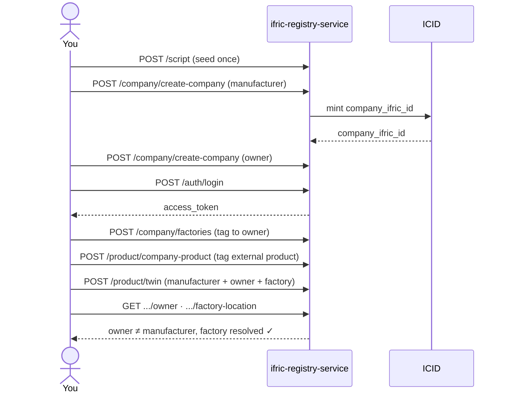

# Ifric Registry Service

Open-source, multi-tenant registry for companies, users, role-based access
control, physical/IoT assets, and digital twins. Built with
[NestJS](https://nestjs.com/) + PostgreSQL (via [TypeORM](https://typeorm.io/)),
with [Keycloak](https://www.keycloak.org/) as the identity provider.

**Contents:** [Architecture](#architecture) ·
[Quick start](#quick-start) ·
[Core concepts](#core-concepts) ·
[Authentication](#authentication) ·
[Usage flow](#usage-flow) ·
[Environment variables](#environment-variables) ·
[ICID integration](#icid-integration) ·
[Running with Docker](#running-with-docker) ·
[Deploying with Helm](#deploying-with-helm) ·
[API documentation](#api-documentation) ·
[Testing](#testing)

## Architecture


Every module needs PostgreSQL, and **all** authentication needs
[Keycloak](#authentication) — there's no built-in fallback. Company
creation and certificates additionally need [ICID](#icid-integration).

| Module | Routes | Owns |
|---|---|---|
| Auth | `/auth/*` | Login, sessions, password management — no company/product data |
| Company | `/company/*` | Company CRUD, access groups, physical assets, factories |
| Product | `/product/*` | Product tagging, digital twins |
| Certificate | `/certificate/*` | ICID-backed certificate issuance/verification |
| Script | `/script` | One-time seed data (see [Usage flow](#usage-flow)) |

## Quick start

Needs a running, already-configured Keycloak instance (see
[Authentication](#authentication)) in addition to PostgreSQL — see
[Environment variables](#environment-variables) for the full list of what
`backend/.env` needs. The Docker path is the easier starting point since it
brings up Postgres + Keycloak for you (**two-pass** — see
[Running with Docker](#running-with-docker) for the required one-time
Keycloak setup in between):

```bash
docker compose up --build   # pass 1: brings up Postgres + Keycloak + migrate;
                             # backend crash-loops until Keycloak is configured
```

A common hybrid workflow once Postgres/Keycloak are up: keep them running via
Docker, then iterate on the app natively for faster reload:

```bash
cd backend
cp .env.example .env      # fill in the required values — see comments in the file
npm install
npm run migration:run     # applies the TypeORM schema to your PostgreSQL database
npm run start:dev
```

App: `http://localhost:4007` · Swagger UI: `/api-docs`

## Core concepts

| Entity | What it is |
|---|---|
| **Company** | Tenant root. Gets a `company_ifric_id` minted by ICID. |
| **Factory** | Physical location, tagged to an owner company. |
| **Product tag** | An external product/asset id linked to a company — the product data itself lives elsewhere, this service only stores the tag. |
| **Digital twin** | Links a product/asset to a manufacturer company + an owner company, optionally a factory. Manufacturer/owner are just *roles* — any company can play either, no separate "become a manufacturer" step. |
| **Access group** | Per-company CRUD-permission role. |
| **Certificate** | ICID-issued/verified, Hedera-backed. |

## Authentication

This service has no built-in auth of its own — [Keycloak](https://www.keycloak.org/)
is the sole identity provider, for both end-user login/tokens and all
password/user-lifecycle management:

| Route | What happens |
|---|---|
| `POST /auth/login` | Same `{email, password, product_name}` body as before — under the hood it's a Resource Owner Password Credentials (ROPC) grant against Keycloak's confidential `ifric` client, then the usual company/access-group resolution. Returns Keycloak-issued `access_token`/`refresh_token`. |
| `POST /auth/refresh` | Exchanges a refresh token via Keycloak. Keycloak rotates refresh tokens by default, so the response includes a new `refresh_token` too — use it for the next refresh. |
| `POST /auth/logout` | Pass the `refresh_token` from `/auth/login` to also revoke the session at Keycloak; omitting it still returns success. |
| `POST /auth/create-user/:admin_mail`, `PATCH /auth/update-password`, `POST /auth/recover-password[-request]`, `DELETE /auth/delete-company-user/:id` | Provision/change/remove credentials via Keycloak's Admin API (confidential `ifric-admin` client), instead of a local bcrypt hash. |

Every guarded route (`AuthGuard`) verifies the bearer token against
Keycloak's realm signing keys (JWKS, cached — no per-request round trip to
Keycloak in the steady state).

**Setup is required before login works.** Both Keycloak clients — `ifric`
(Direct Access Grants enabled, for end-user tokens) and `ifric-admin` (its
service account granted the realm-management client's `manage-users` role,
for the Admin API calls above) — must already exist in the target realm.
This is a one-time **manual** step; see [Running with Docker](#running-with-docker)
or [Deploying with Helm](#deploying-with-helm) for the walkthrough. The app
fails fast at boot if the required `KEYCLOAK_*` env vars are missing — see
[Environment variables](#environment-variables).

## Usage flow

Seed once, then create → tag → query. Manufacturer and owner are always
two distinct companies:



**Good to know:** deleting a factory still referenced by a twin is blocked
(`409`) — detach the twin first. `POST /company/company-asset` needs a
`type: "asset" | "gateway" | "server"` field alongside the matching
`*_ifric_id` field.

## Environment variables

At minimum you need `DB_HOST`, `DB_NAME`, `KEYCLOAK_URL`, `KEYCLOAK_REALM`,
`KEYCLOAK_CLIENT_SECRET`, and `KEYCLOAK_ADMIN_CLIENT_SECRET`.
`ICID_SERVICE_BACKEND_URL` and `COMPANY_DEFAULT_CODE` are also validated at
startup — the app won't boot without them — but only need to be
*functionally* correct (a reachable ICID) if you use company creation.
`HEDERA_KEY_SECRET` is fully optional: leave it unset to run without the
certificate feature at all. Full list with examples: `backend/.env.example`.

| Variable | Required | Purpose |
|---|---|---|
| `DB_HOST` | Yes | PostgreSQL host |
| `DB_NAME` | Yes | PostgreSQL database name |
| `DB_PORT` | No (default `5432`) | PostgreSQL port |
| `DB_USER` | No (default `ifric`) | PostgreSQL user |
| `DB_PASSWORD` | No (default `ifric`) | PostgreSQL password |
| `KEYCLOAK_URL` | Yes | Base URL of the Keycloak instance |
| `KEYCLOAK_REALM` | Yes | Realm containing the `ifric`/`ifric-admin` clients |
| `KEYCLOAK_CLIENT_SECRET` | Yes | Secret for the confidential `ifric` client (end-user login) |
| `KEYCLOAK_ADMIN_CLIENT_SECRET` | Yes | Secret for the confidential `ifric-admin` client (Admin API) |
| `KEYCLOAK_CLIENT_ID` | No (default `ifric`) | Override only if you named the client differently |
| `KEYCLOAK_ADMIN_CLIENT_ID` | No (default `ifric-admin`) | Override only if you named the client differently |
| `ICID_SERVICE_BACKEND_URL` | Yes* | Base URL of an ICID-compatible instance |
| `COMPANY_DEFAULT_CODE` | Yes* | `IFX-COM-NAP` — see [ICID integration](#icid-integration) for why |
| `HEDERA_KEY_SECRET` | No | Set to enable `/certificate/*` — unset disables those routes entirely, app still boots |
| `PORT` | No (default `4007`) | HTTP port |
| `CORS_ORIGIN` | No | Comma-separated allowed browser origins |

<sub>* app refuses to boot without a value set; only needs to actually work if you use company creation.</sub>

## ICID integration

[ICID](https://github.com/IndustryFusion/icidservice) is a separate
open-source service that mints `company_ifric_id`s and issues/verifies
Hedera-backed certificates. Not bundled here — point
`ICID_SERVICE_BACKEND_URL` at a running instance.

**Contract:** `POST /company` (mint), `DELETE /company/:id` (rollback on
failure), `POST /certificate/create-company-certificate`,
`POST /certificate/verify-company-certificate`,
`POST /certificate/verify-all-company-certificate`.

Certificates are optional and controlled entirely by `HEDERA_KEY_SECRET`:
set it and `/certificate/*` is registered; leave it unset and those routes
don't exist (`404`, not just unauthenticated/broken) — company creation
and everything else works either way.

## Running with Docker

| File | Starts |
|---|---|
| `docker-compose.yaml` | App + PostgreSQL + Keycloak, plus a one-shot `migrate` service that applies TypeORM migrations before the app starts |
| `docker-compose.full.yaml` | App + PostgreSQL + Keycloak + a real ICID (with its own required MongoDB), pulled as the published `ibn40/icid-backend:latest` image, unmodified — no build step |
| `backend/Dockerfile` | Standalone image — bring your own PostgreSQL and Keycloak |

`docker-compose.yaml` already sets `DB_HOST`/`DB_PORT`/`DB_USER`/
`DB_PASSWORD`/`DB_NAME` for you (overriding whatever's in `.env`) — the only
things you need to fill into `backend/.env` yourself are the `KEYCLOAK_*`
values below, plus `ICID_SERVICE_BACKEND_URL`/`COMPANY_DEFAULT_CODE`
(already defaulted in `.env.example`) and optionally `HEDERA_KEY_SECRET`.
Full reference: [Environment variables](#environment-variables).

Keycloak comes up **unconfigured** — the backend container will crash-loop
on its own fail-fast env-var check until you complete a one-time manual
setup and fill in `backend/.env`. Two passes:

```bash
# 1. Bring up Postgres/Keycloak/migrate — the backend will crash-loop, that's expected.
docker compose up --build
```

Then, with Keycloak reachable at `http://localhost:8080`:

1. Log in to the admin console (`admin`/`admin` — dev-only credentials, see
   the compose file's comments).
2. Create a realm (e.g. `ifric`).
3. Create a **confidential** client named exactly `ifric`, with **Direct
   Access Grants** enabled (Clients → Create → Client authentication: On,
   Authentication flow: Direct access grants). Copy its secret from
   Clients → `ifric` → Credentials.
4. Create a second **confidential** client named exactly `ifric-admin`,
   with its **Service account roles** enabled. Under its Service account
   roles tab, assign the `realm-management` client's `manage-users` role.
   Copy its secret the same way.
5. Put both secrets, the realm name, and the Keycloak URL into
   `backend/.env` (`KEYCLOAK_URL=http://localhost:8080`,
   `KEYCLOAK_REALM`, `KEYCLOAK_CLIENT_SECRET`,
   `KEYCLOAK_ADMIN_CLIENT_SECRET`).

```bash
# 2. Bring the stack up again — the backend now boots and can authenticate.
docker compose up --build
# — or, with a real ICID —
docker compose -f docker-compose.full.yaml up --build
curl -X POST http://localhost:4010/script   # seed ICID (once)
curl -X POST http://localhost:4007/script   # seed this service (once)
```

`docker-compose.full.yaml` follows the same two-pass sequence — its
`KEYCLOAK_CLIENT_SECRET`/`KEYCLOAK_ADMIN_CLIENT_SECRET` are read from a
`.env` file next to that compose file (Compose's own variable-substitution
mechanism, distinct from `backend/.env`) or your shell environment.

<details>
<summary>Standalone image, network troubleshooting</summary>

**Standalone image (bring your own PostgreSQL):**

```bash
cd backend
docker build -t ifric-registry-service .
docker run -p 4007:4007 --env-file .env ifric-registry-service
```

Run migrations against it first (`npm run migration:run` from `backend/`,
with `DB_HOST`/etc. pointed at the same database) — the standalone image
doesn't apply them automatically the way `docker-compose.yaml`'s `migrate`
service does.

`DB_HOST` must be reachable **from inside the container** — `localhost`
there means "this container," not your machine:

- Same Docker network → use the container/service name (e.g. `postgres`).
- Docker Desktop (Mac/Windows) reaching PostgreSQL on your host → `host.docker.internal`.
- Remote/managed PostgreSQL → its real host.

**If `docker build` hangs on `RUN npm install`** with no output, your
Docker daemon may block build-time outbound network access (seen in some
sandboxed/CI environments). Confirm with:

```bash
docker build --network=host -t test -<<< $'FROM node:20-alpine\nRUN wget -qO- https://registry.npmjs.org/'
```

If that succeeds where a plain `docker build` hangs, add `--network=host`
to your build command.

</details>

## Deploying with Helm

A Helm chart at `charts/ifric-registry-service/` mirrors the two Compose
files above for Kubernetes — the default profile (app + its own PostgreSQL
+ Keycloak, ICID external) via `values.yaml` alone, or the full profile (+
a bundled ICID + its own MongoDB) by layering `values-full.yaml` on top.
Migrations run as an `initContainer` on the backend Pod rather than a
separate one-shot service.

Keycloak is bundled and enabled by default in **both** profiles (unlike
ICID, which stays opt-in via `icid.enabled`) — but, same as with Compose,
the bundled instance comes up unconfigured. `helm install` will succeed and
the backend Pod will crash-loop on its fail-fast env-var check until you
complete the same one-time manual realm/client setup described in
[Running with Docker](#running-with-docker) (against this release's own
Keycloak Service) and then `helm upgrade` with
`secrets.keycloakClientSecret`/`secrets.keycloakAdminClientSecret` set.
`env.icidServiceBackendUrl` still needs to point at a real external ICID
for the default profile, same as `docker-compose.yaml`'s `.env`
requirement. See
[`charts/ifric-registry-service/README.md`](charts/ifric-registry-service/README.md)
for the full install commands and secrets/upgrade behavior.

## API documentation

- Live, interactive: `/api-docs` (Swagger UI) once the app is running.
- Static specs in `backend/`: `openapi.yaml` (full surface),
  `openapi.company.yaml` (`/company/*` only).

Both are generated from the running app's Swagger metadata, not
hand-written — regenerate after changing any controller:

```bash
cd backend
npm run start:dev &
npm run generate:openapi
```

## Testing

```bash
cd backend
npm test          # unit tests
npm run test:e2e  # e2e tests (currently boilerplate)
npm run lint
npm run build
```

## License

Apache License 2.0 — see [`LICENSE`](LICENSE).
