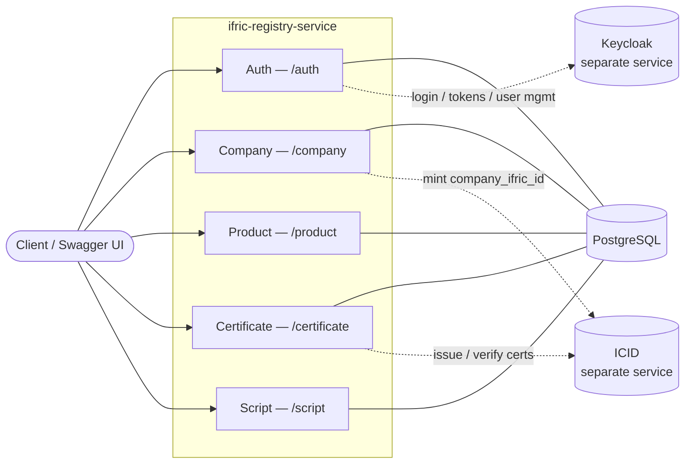
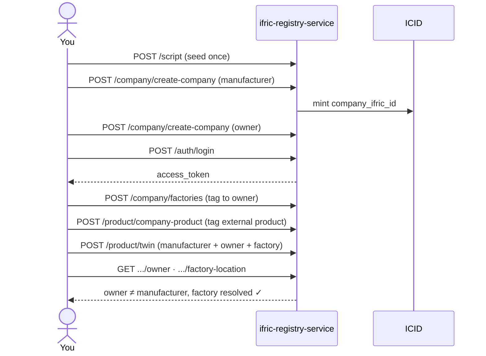

# Ifric Registry Service

Open-source, multi-tenant registry for companies, users, role-based access
control, physical/IoT assets, and digital twins. Built with
[NestJS](https://nestjs.com/) + PostgreSQL (via [TypeORM](https://typeorm.io/)),
authenticated via [Keycloak](https://www.keycloak.org/).

**Contents:** [Architecture](#architecture) ·
[Quick start](#quick-start) ·
[Core concepts](#core-concepts) ·
[Usage flow](#usage-flow) ·
[Authentication](#authentication) ·
[Environment variables](#environment-variables) ·
[Running with Docker](#running-with-docker) ·
[Deploying with Helm](#deploying-with-helm) ·
[ICID integration](#icid-integration) ·
[API documentation](#api-documentation) ·
[Testing](#testing)

## Architecture



Every module needs PostgreSQL. All authentication needs Keycloak (no local
fallback). Company creation and certificates additionally need ICID.

| Module | Routes | Owns |
|---|---|---|
| Auth | `/auth/*` | Login, sessions, password management — no company/product data |
| Company | `/company/*` | Company CRUD, access groups, physical assets, factories |
| Product | `/product/*` | Product tagging, digital twins |
| Certificate | `/certificate/*` | ICID-backed certificate issuance/verification |
| Script | `/script` | One-time seed data (see [Usage flow](#usage-flow)) |

## Quick start

The fastest path is Docker — it brings up Postgres + Keycloak for you:

```bash
docker compose up --build
```

This starts everything, but Keycloak comes up unconfigured, so the backend
will crash-loop until you finish a short one-time setup — see
[Running with Docker](#running-with-docker).

**Prefer running the app natively?** Keep Postgres + Keycloak in Docker and
run the backend yourself for faster reload:

```bash
cd backend
cp .env.example .env      # fill in the values — see Environment variables
npm install
npm run migration:run
npm run start:dev
```

App: `http://localhost:4007` · Swagger UI: `/api-docs`

## Core concepts

| Entity | What it is |
|---|---|
| **Company** | Tenant root. Gets a `company_ifric_id` minted by ICID. |
| **Factory** | Physical location, tagged to an owner company. |
| **Product tag** | An external product/asset id linked to a company — the product data itself lives elsewhere, this service only stores the tag. |
| **Digital twin** | Links a product/asset to a manufacturer company + an owner company, optionally a factory. Manufacturer/owner are just *roles* — any company can play either. |
| **Access group** | Per-company CRUD-permission role. |
| **Certificate** | ICID-issued/verified, Hedera-backed. |

## Usage flow

A manufacturer tags a product; an owner company gets tagged as where that
product physically lives. The two are always separate companies.

| Step | Call | What happens |
|---|---|---|
| 1 | `POST /script` | Seed once: default access groups + category taxonomy |
| 2 | `POST /company/create-company` ×2 | Create the manufacturer and the owner (ICID mints a `company_ifric_id` for each) |
| 3 | `POST /auth/login` | Log in as one company's admin user → `access_token` |
| 4 | `POST /company/factories` | Tag a factory location to the owner |
| 5 | `POST /product/company-product` | Tag an external product to the manufacturer |
| 6 | `POST /product/twin` | Link manufacturer + owner + factory as one digital twin |
| 7 | `GET /product/:id/owner`, `GET /product/:id/factory-location` | Read it back — owner ≠ manufacturer, factory resolved |



**Good to know:** deleting a factory still referenced by a twin is blocked
(`409`) — detach the twin first. `POST /company/company-asset` needs a
`type: "asset" | "gateway" | "server"` field alongside the matching
`*_ifric_id` field.

## Authentication

Keycloak is the sole identity provider — there's no local auth to fall
back on.

| Route | What happens |
|---|---|
| `POST /auth/login` | Same `{email, password, product_name}` body as always. Verified against Keycloak (`ifric` client), then resolves company/access-group data. Returns `access_token`/`refresh_token`. |
| `POST /auth/refresh` | Exchanges a refresh token via Keycloak. Keycloak rotates refresh tokens, so the response includes a new one — use it next time. |
| `POST /auth/logout` | Pass `refresh_token` to also revoke the session at Keycloak. |
| `POST /auth/create-user`, `update-password`, `recover-password`, `delete-company-user` | Manage credentials via Keycloak's Admin API (`ifric-admin` client). |

Every guarded route checks the bearer token against Keycloak's signing keys
(JWKS, cached — no per-request round trip).

**Setup required before login works:** two Keycloak clients — `ifric`
(Direct Access Grants, for end-user tokens) and `ifric-admin` (service
account with `manage-users`, for the Admin API) — must exist in the target
realm. This is a one-time manual step; see
[Running with Docker](#running-with-docker) or
[Deploying with Helm](#deploying-with-helm).

## Environment variables

Full reference with comments: `backend/.env.example`.

| Variable | Required | Purpose |
|---|---|---|
| `DB_HOST`, `DB_NAME` | Yes | PostgreSQL host/database |
| `DB_PORT`, `DB_USER`, `DB_PASSWORD` | No | Default `5432`/`ifric`/`ifric` |
| `KEYCLOAK_URL`, `KEYCLOAK_REALM` | Yes | Keycloak instance + realm |
| `KEYCLOAK_CLIENT_SECRET` | Yes | Secret for the `ifric` client |
| `KEYCLOAK_ADMIN_CLIENT_SECRET` | Yes | Secret for the `ifric-admin` client |
| `KEYCLOAK_CLIENT_ID`, `KEYCLOAK_ADMIN_CLIENT_ID` | No | Default `ifric`/`ifric-admin` |
| `ICID_SERVICE_BACKEND_URL` | Yes* | Base URL of an ICID-compatible instance |
| `COMPANY_DEFAULT_CODE` | Yes* | `IFX-COM-NAP` — see [ICID integration](#icid-integration) |
| `HEDERA_KEY_SECRET` | No | Set to enable `/certificate/*` |
| `PORT`, `CORS_ORIGIN` | No | HTTP port / allowed browser origins |

<sub>* app fails fast at boot without a value; only needs to actually work if you use company creation.</sub>

## Running with Docker

| File | Starts |
|---|---|
| `docker-compose.yaml` | App + PostgreSQL + Keycloak, plus a one-shot `migrate` service |
| `docker-compose.full.yaml` | Same, plus a real ICID (+ its own MongoDB), unmodified `ibn40/icid-backend:latest` |
| `backend/Dockerfile` | Standalone image — bring your own PostgreSQL and Keycloak |

Postgres/DB vars are already set for you; only Keycloak needs your input.
Two passes:

```bash
docker compose up --build   # pass 1 — Postgres/Keycloak/migrate come up,
                             # backend crash-loops until Keycloak is configured
```

With Keycloak up at `http://localhost:8080`:

1. Log in to the admin console (`admin`/`admin` — dev-only).
2. Create a realm (e.g. `ifric`).
3. Create a **confidential** client `ifric` with **Direct Access Grants**
   enabled. Copy its secret (Clients → `ifric` → Credentials).
4. Create a second **confidential** client `ifric-admin` with its
   **service account** enabled, granted the `realm-management` client's
   `manage-users` role. Copy its secret.
5. Put both secrets + the realm + `KEYCLOAK_URL=http://localhost:8080`
   into `backend/.env`.

```bash
docker compose up --build   # pass 2 — backend now boots and can authenticate
# — or, with a real ICID —
docker compose -f docker-compose.full.yaml up --build
curl -X POST http://localhost:4010/script   # seed ICID (once)
curl -X POST http://localhost:4007/script   # seed this service (once)
```

`docker-compose.full.yaml` follows the same two-pass sequence; its Keycloak
secrets come from a `.env` file next to that compose file, or your shell.

<details>
<summary>Standalone image, network troubleshooting</summary>

```bash
cd backend
docker build -t ifric-registry-service .
docker run -p 4007:4007 --env-file .env ifric-registry-service
```

Run migrations against it first (`npm run migration:run` from `backend/`)
— the standalone image doesn't apply them automatically.

`DB_HOST` must be reachable **from inside the container**:

- Same Docker network → use the container/service name (e.g. `postgres`).
- Docker Desktop reaching PostgreSQL on your host → `host.docker.internal`.
- Remote/managed PostgreSQL → its real host.

**If `docker build` hangs on `RUN npm install`**, your Docker daemon may
block build-time network access (seen in some sandboxed/CI environments) —
add `--network=host` to the build command.

</details>

## Deploying with Helm

A chart at `charts/ifric-registry-service/` mirrors the two Compose files
— default profile via `values.yaml` alone, full profile (+ bundled ICID)
by layering `values-full.yaml` on top. Keycloak is bundled and enabled by
default in both profiles.

Same as Compose: `helm install` succeeds, but the backend Pod crash-loops
until you complete the manual Keycloak setup above (against the release's
own Keycloak Service) and `helm upgrade` with
`secrets.keycloakClientSecret`/`secrets.keycloakAdminClientSecret` set.

See [`charts/ifric-registry-service/README.md`](charts/ifric-registry-service/README.md)
for install commands, secrets, and the full Keycloak walkthrough.

## ICID integration

[ICID](https://github.com/IndustryFusion/icidservice) is a separate
open-source service that mints `company_ifric_id`s and issues/verifies
Hedera-backed certificates. Not bundled here — point
`ICID_SERVICE_BACKEND_URL` at a running instance.

**Contract:** `POST /company` (mint), `DELETE /company/:id` (rollback on
failure), `POST /certificate/create-company-certificate`,
`POST /certificate/verify-company-certificate`,
`POST /certificate/verify-all-company-certificate`.

Certificates are optional, controlled by `HEDERA_KEY_SECRET`: set it and
`/certificate/*` is registered; leave it unset and those routes don't
exist (`404`) — everything else works either way.

## API documentation

- Live, interactive: `/api-docs` (Swagger UI) once the app is running.
- Static specs in `backend/`: `openapi.yaml` (full surface),
  `openapi.company.yaml` (`/company/*` only).

Both are generated from the running app, not hand-written — regenerate
after changing any controller:

```bash
cd backend
npm run start:dev &
npm run generate:openapi
```

## Testing

```bash
cd backend
npm test          # unit tests
npm run test:e2e  # e2e tests (currently boilerplate)
npm run lint
npm run build
```

## License

Apache License 2.0 — see [`LICENSE`](LICENSE).
