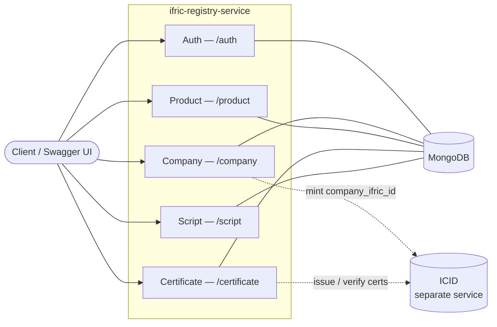
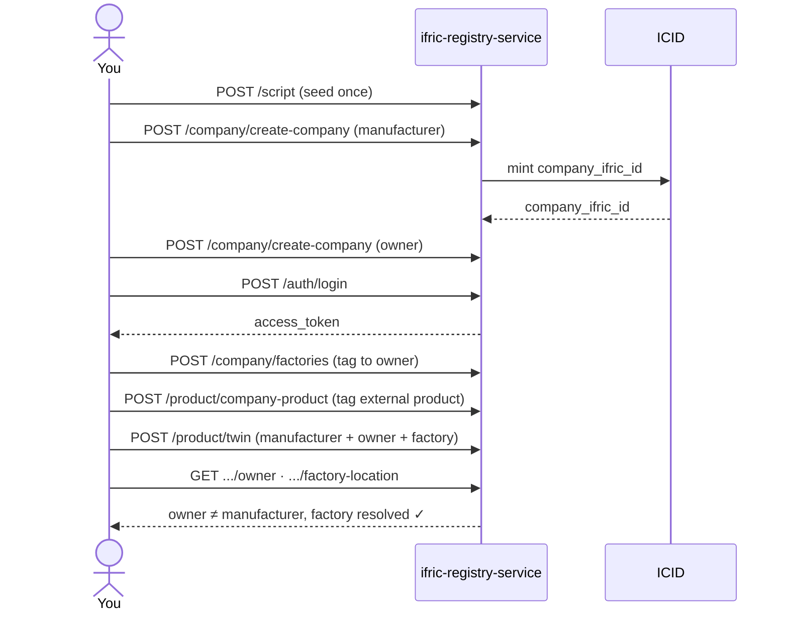

# Ifric Registry Service

Open-source, multi-tenant registry for companies, users, role-based access
control, physical/IoT assets, and digital twins. Built with
[NestJS](https://nestjs.com/) + MongoDB.

## Architecture



Everything runs on MongoDB alone **except company creation and
certificates**, which need [ICID](#icid-integration) — a separate service.

| Module | Routes | Owns |
|---|---|---|
| Auth | `/auth/*` | Login, sessions, password management — no company/product data |
| Company | `/company/*` | Company CRUD, access groups, physical assets, factories |
| Product | `/product/*` | Product tagging, digital twins |
| Certificate | `/certificate/*` | ICID-backed certificate issuance/verification |
| Script | `/script` | One-time seed data (see [Usage flow](#usage-flow)) |

## Quick start

```bash
cd backend
cp .env.example .env      # fill in the required values — see comments in the file
npm install && npm run start:dev
```

Or with Docker (see [Running with Docker](#running-with-docker) for details):

```bash
docker compose up --build                              # app + MongoDB
docker compose -f docker-compose.full.yaml up --build   # + a real ICID instance
```

App: `http://localhost:4007` · Swagger UI: `/api-docs`

## Core concepts

| Entity | What it is |
|---|---|
| **Company** | Tenant root. Gets a `company_ifric_id` minted by ICID. |
| **Factory** | Physical location, tagged to an owner company. |
| **Product tag** | An external product/asset id linked to a company — the product data itself lives elsewhere, this service only stores the tag. |
| **Digital twin** | Links a product/asset to a manufacturer company + an owner company, optionally a factory. Manufacturer/owner are just *roles* — any company can play either, no separate "become a manufacturer" step. |
| **Access group** | Per-company CRUD-permission role. |
| **Certificate** | ICID-issued/verified, Hedera-backed. |

## Authentication

`POST /auth/login` returns two JWTs:

| Token | Lifetime | Notes |
|---|---|---|
| `access_token` | 1 hour | Stateless — checked by signature only. Stays valid until it expires, even after logout. |
| `refresh_token` | 30 days | Stored server-side. `POST /auth/refresh` exchanges it for a new access token. `/auth/logout` clears it — the only place revocation is enforced. |

A token minted for one purpose can't be used for the other
(`type: 'access'` vs `'refresh'`).

## Usage flow

Seed once, then create → tag → query. Manufacturer and owner are always
two distinct companies:



**Good to know:** deleting a factory still referenced by a twin is blocked
(`409`) — detach the twin first. `POST /company/company-asset` needs a
`type: "asset" | "gateway" | "server"` field alongside the matching
`*_ifric_id` field.

## Environment variables

At minimum you need `MONGO_URL` and `JWT_SECRET`. `ICID_SERVICE_BACKEND_URL`
and `COMPANY_DEFAULT_CODE` are validated at startup — the app won't boot
without them — but only need to be *functionally* correct (a reachable
ICID) if you use company creation. `HEDERA_KEY_SECRET` is fully optional:
leave it unset to run without the certificate feature at all. Full list
with examples: `backend/.env.example`.

| Variable | Required | Purpose |
|---|---|---|
| `MONGO_URL` | Yes | MongoDB connection string |
| `JWT_SECRET` | Yes | Signs/verifies access + refresh JWTs |
| `ICID_SERVICE_BACKEND_URL` | Yes* | Base URL of an ICID-compatible instance |
| `COMPANY_DEFAULT_CODE` | Yes* | `IFX-COM-NAP` — see [ICID integration](#icid-integration) for why |
| `HEDERA_KEY_SECRET` | No | Set to enable `/certificate/*` — unset disables those routes entirely, app still boots |
| `PORT` | No (default `4007`) | HTTP port |
| `CORS_ORIGIN` | No | Comma-separated allowed browser origins |

<sub>* app refuses to boot without a value set; only needs to actually work if you use company creation.</sub>

## ICID integration

[ICID](https://github.com/IndustryFusion/icidservice) is a separate
open-source service that mints `company_ifric_id`s and issues/verifies
Hedera-backed certificates. Not bundled here — point
`ICID_SERVICE_BACKEND_URL` at a running instance.

**Contract:** `POST /company` (mint), `DELETE /company/:id` (rollback on
failure), `POST /certificate/create-company-certificate`,
`POST /certificate/verify-company-certificate`,
`POST /certificate/verify-all-company-certificate`.

Certificates are optional and controlled entirely by `HEDERA_KEY_SECRET`:
set it and `/certificate/*` is registered; leave it unset and those routes
don't exist (`404`, not just unauthenticated/broken) — company creation
and everything else works either way.

## Running with Docker

| File | Starts |
|---|---|
| `docker-compose.yaml` | App + MongoDB (single-node replica set) |
| `docker-compose.full.yaml` | App + MongoDB + a real ICID, built from its own repo, unmodified |
| `backend/Dockerfile` | Standalone image — bring your own MongoDB |

```bash
docker compose up --build
# — or, with a real ICID —
docker compose -f docker-compose.full.yaml up --build
curl -X POST http://localhost:4010/script   # seed ICID (once)
curl -X POST http://localhost:4007/script   # seed this service (once)
```

MongoDB runs as a single-node replica set in both compose files — this is
**required**, not optional: `createCompany` uses a MongoDB transaction,
which only works against a replica set.

<details>
<summary>Standalone image, network troubleshooting</summary>

**Standalone image (bring your own MongoDB):**

```bash
cd backend
docker build -t ifric-registry-service .
docker run -p 4007:4007 --env-file .env ifric-registry-service
```

`MONGO_URL` must be reachable **from inside the container** — `localhost`
there means "this container," not your machine:

- Same Docker network → use the container/service name (`mongodb://mongo:27017/...`).
- Docker Desktop (Mac/Windows) reaching a MongoDB on your host → `mongodb://host.docker.internal:27017/...`.
- Remote/managed MongoDB → its real connection string.

If a replica set member self-identifies with a hostname your container
can't resolve, append `&directConnection=true` to `MONGO_URL`.

**If `docker build` hangs on `RUN npm install`** with no output, your
Docker daemon may block build-time outbound network access (seen in some
sandboxed/CI environments). Confirm with:

```bash
docker build --network=host -t test -<<< $'FROM node:20-alpine\nRUN wget -qO- https://registry.npmjs.org/'
```

If that succeeds where a plain `docker build` hangs, add `--network=host`
to your build command.

</details>

## API documentation

- Live, interactive: `/api-docs` (Swagger UI) once the app is running.
- Static specs in `backend/`: `openapi.yaml` (full surface),
  `openapi.company.yaml` (`/company/*` only).

Both are generated from the running app's Swagger metadata, not
hand-written — regenerate after changing any controller:

```bash
cd backend
npm run start:dev &
npm run generate:openapi
```

## Testing

```bash
cd backend
npm test          # unit tests
npm run test:e2e  # e2e tests (currently boilerplate)
npm run lint
npm run build
```

## License

Apache License 2.0 — see [`LICENSE`](LICENSE).
