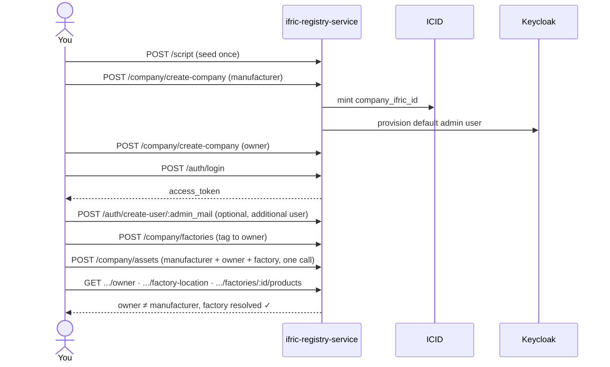

# Ifric Registry Service

Ifric Registry Service is an open-source, multi-tenant registry for
companies, users, role-based access control, physical/IoT assets, and
digital twins. It's built with [NestJS](https://nestjs.com/) and
PostgreSQL (via [TypeORM](https://typeorm.io/)). Authentication has no
built-in implementation of its own — [Keycloak](https://www.keycloak.org/)
is the sole identity provider for every guarded route, with no local
fallback. Company creation and Hedera-backed certificates additionally
depend on [ICID](https://github.com/IndustryFusion/icidservice), a
separate open-source service that mints each company's canonical id. The
repo ships both a Docker Compose setup and a Helm chart, so the same app
can be run locally or deployed to Kubernetes with the same configuration
shape.

## Prerequisites

What you need on hand *before* following any of the setup steps below —
which of these actually matter depends on which path you take:

| Dependency | Needed for |
|---|---|
| **Docker + Docker Compose v2** | [Local Development](#local-development)'s Docker path — brings up PostgreSQL + Keycloak (+ ICID, in the full profile) for you |
| **Node.js 20+ and npm** | Running the backend natively instead of via Docker, and any `npm run ...` script (migrations, tests, OpenAPI generation) |
| **A Kubernetes cluster, `kubectl`, and Helm 3** | [Kubernetes Deployment](#kubernetes-deployment) only |
| **A container registry** (Docker Hub, GHCR, ECR, ...) | Kubernetes Deployment only — the Helm chart doesn't build images; you build and push `backend/Dockerfile` yourself first |
| **A running Keycloak instance** | Always — either the bundled one (Docker/Helm) or your own external one. No local-auth fallback exists |
| **A running ICID-compatible instance** | Only if you use company creation or certificates — either the bundled one (`docker-compose.full.yaml` / `values-full.yaml`) or an external one. See [ICID Dependency](#icid-dependency) |
| **PostgreSQL 16** | Always — bundled by both the Docker and Helm paths; only relevant to source yourself if you point at an external instance |

None of the above is provisioned by this repo itself except via the
explicitly-bundled Docker/Helm paths — read [Local Development](#local-development)
or [Kubernetes Deployment](#kubernetes-deployment) before running anything.

## Contents

- [Prerequisites](#prerequisites)
- [API Overview](#api-overview)
- [Keycloak Authentication](#keycloak-authentication)
- [Usage Flow](#usage-flow)
- [ICID Dependency](#icid-dependency)
- [Kubernetes Deployment](#kubernetes-deployment)
- [Local Development](#local-development)
- [Notes / Troubleshooting](#notes--troubleshooting)

## API Overview

| Controller | Routes | Endpoints | Owns |
|---|---|---|---|
| Auth | `/auth/*` | 22 | Login, sessions, credential/user-lifecycle management — no company/asset data of its own |
| Company | `/company/*` | 49 | Company CRUD, access groups (RBAC roles), factories, assets (see below), gateway/server |
| Product | `/product/*` | 2 | Local product catalog only (id↔name lookup) — everything asset/digital-twin-related lives under `/company/assets/*` |
| Certificate | `/certificate/*` | 5 | ICID-backed certificate issuance/verification — only registered when `HEDERA_KEY_SECRET` is set |
| Script | `/script*` | 2 | One-time seed data for a fresh deployment (see [Usage Flow](#usage-flow)) |

**Assets** (`/company/assets/*`) merge what used to be two separate ideas —
a bare physical-asset tag and a manufacturer/owner/factory "digital twin"
— into one object. A row starts physical-only; it becomes a twin once
`owner_company_ifric_id` (+ optionally `factory_id`) is set on it. See
[`docs/api-reference.md`](docs/api-reference.md) for the full route list.

Full per-endpoint reference, including which routes are public vs.
Keycloak-guarded vs. additionally company/RBAC-scoped:
[`docs/api-reference.md`](docs/api-reference.md).

That table is hand-maintained; the app itself is the authoritative source:

- **Live, interactive:** Swagger UI at `/api-docs` once the app is running.
- **Static specs**, generated from the running app: `backend/openapi.yaml`
  (full surface), `backend/openapi.company.yaml` (`/company/*` only).
  Regenerate with `npm run generate:openapi` (from `backend/`, app must
  already be running) after changing any controller.

## Keycloak Authentication

Keycloak issues, refreshes, and verifies every token, and owns all
credential/user-lifecycle state — this app never hashes a password or
signs a JWT itself. Two Keycloak clients are involved:

- **`ifric`** — a confidential client with Direct Access Grants enabled.
  End users authenticate against it: `POST /auth/login`, a Resource Owner
  Password Credentials grant. Every `CompanyUser`'s token carries
  `company_ifric_id`/`user_id` claims (via a realm protocol mapper), and
  company-scoped endpoints check those claims against the request.
- **`ifric-admin`** — a confidential, service-account-enabled client used
  only for Keycloak's Admin API (create/reset-password/delete users) —
  kept separate so a leaked end-user-facing client secret can't also
  manage the realm's users.

Both clients, plus two protocol mappers on `ifric`, must already exist in
the target realm — this is a one-time manual step (the app fails fast at
boot without them):

- **Doing it:** [`docs/keycloak-first-time-checklist.md`](docs/keycloak-first-time-checklist.md)
  — click-by-click admin-console steps, for both local Docker and
  Kubernetes, ending in a verification you can run.
- **Understanding it:** [`docs/keycloak-setup.md`](docs/keycloak-setup.md)
  — the same setup with the reasoning, the two realm defaults that break it
  silently, and how the claims are enforced at request time.

**Getting and using a token:** RBAC in this app is **one `AccessGroup` role
per user per company** — no per-product dimension. Login just needs
credentials; the response's `access_group` field is that one role.

```bash
curl -X POST http://localhost:4007/auth/login \
  -H "Content-Type: application/json" \
  -d '{
    "email": "admin@acme.example",
    "password": "your-password"
  }'
# → { "status": 200, "data": { "access_token": "...", "refresh_token": "...", "access_group": { ... }, ... } }

curl http://localhost:4007/company/get-company-details/<company_ifric_id> \
  -H "Authorization: Bearer <access_token>"
```

Tokens are short-lived; exchange the `refresh_token` for a new pair via
`POST /auth/refresh` rather than logging in again each time.

## Usage Flow

A manufacturer creates an asset; an owner company gets tagged onto that
same asset as the location where it physically lives — that's what "twins"
it. The two are always separate companies.

| Step | Call | What happens |
|---|---|---|
| 1 | `POST /script` | Seed once: default access groups + category taxonomy |
| 2 | `POST /company/create-company` ×2 | Create the manufacturer and the owner. ICID mints a `company_ifric_id` for each, and a default admin user (full RBAC, its own Keycloak account) is provisioned automatically for each company |
| 3 | `POST /auth/login` | Log in as one company's admin user → `access_token` |
| 4 | `POST /auth/create-user/:admin_mail` | (Optional) create an additional user for that company, with its own `AccessGroup` role |
| 5 | `POST /company/factories` | Tag a factory location to the owner |
| 6 | `POST /company/assets` | Manufacturer creates an asset, already tagged to the owner + factory in one call (`owner_company_ifric_id` + `factory_id`) — this is what "twins" it |
| 7 | `GET /company/assets/:id/owner`, `GET /company/assets/:id/factory-location` | Read it back — owner ≠ manufacturer, factory resolved |
| 8 | `GET /company/factories/:id/products` | Read back the same link from the factory's side — every asset URN located there |



**Good to know:** deleting a factory still referenced by an asset is
blocked (`409`) — detach it first (`PATCH /company/assets/:id` with a
different/no `factory_id`, or delete the asset). `POST /company/devices`
is for gateways/servers (`type: "gateway" | "server"`) — assets
go through `POST /company/assets` instead.

## ICID Dependency

[ICID](https://github.com/IndustryFusion/icidservice) is a separate
open-source service that mints `company_ifric_id`s and issues/verifies
Hedera-backed certificates. It's not application code in this repo — it
runs as its own service, in one of two ways:

- **External** (default): point `ICID_SERVICE_BACKEND_URL` at an instance
  you already run.
- **Bundled**: `docker-compose.full.yaml` (local) or the Helm chart's
  `values-full.yaml` overlay (Kubernetes) both run the unmodified,
  published `ibn40/icid-backend:latest` image, alongside its own required
  MongoDB.

**Contract:** `POST /company` (mint), `DELETE /company/:id` (rollback on
failure), `POST /certificate/create-company-certificate`,
`POST /certificate/verify-company-certificate`,
`POST /certificate/verify-all-company-certificate`.

Certificates are optional, controlled by `HEDERA_KEY_SECRET`: set it and
`/certificate/*` is registered; leave it unset and those routes don't
exist (`404`) — everything else works either way.

## Kubernetes Deployment

A Helm chart at `charts/ifric-registry-service/` mirrors the two Compose
profiles — `values.yaml` alone (default, external ICID), or layer
`values-full.yaml` on top (bundled ICID). Every backing service —
PostgreSQL, Keycloak, ICID — can independently be **bundled** (the chart
deploys it for you) or **external** (you bring your own). Each subsection
below follows the same shape: which way it defaults, the one flag that
switches it, and the exact value(s) to set for the other way — so you can
tell at a glance how any one of them is currently configured and how to
flip it.

### Database (PostgreSQL)

**Bundled by default** (`postgres.enabled=true`) — the chart deploys
`postgres:16` as a `StatefulSet`, and the official image auto-creates the
user/database from these same values on first boot, no manual step
needed. **External**: set `postgres.enabled=false` and point
`postgres.external.host`/`.port` at an instance you already run — it must
already have a database + user matching the values below.

| Helm value | Default | Backend env var | Notes |
|---|---|---|---|
| `postgres.auth.database` | `ifric_registry_service` | `DB_NAME` | |
| `postgres.auth.user` | `ifric` | `DB_USER` | |
| `postgres.auth.password` | `ifric` | `DB_PASSWORD` | Also becomes the bundled Postgres's own password; for an external instance, must match what it already expects |
| `postgres.external.host`, `postgres.external.port` | unset, `5432` | `DB_HOST`, `DB_PORT` | Only read when `postgres.enabled=false` — ignored otherwise, the chart resolves the in-cluster Service address itself |
| `env.dbSsl`, `env.dbSslRejectUnauthorized`, `env.dbSslCa` | `false`, `true`, unset | `DB_SSL`, `DB_SSL_REJECT_UNAUTHORIZED`, `DB_SSL_CA` | **Lives under `env.*`, not `postgres.*`** — a known chart naming quirk, despite being Postgres-specific. The backend itself defaults `DB_SSL` on; the chart explicitly sets it `false` here since the bundled Postgres has no TLS listener — flip to `true` only once pointed at a real external instance that requires TLS |

### Keycloak

**Bundled by default** (`keycloak.enabled=true`). **External**: set
`keycloak.enabled=false` and point `env.keycloak.url`/`env.keycloak.realm`
at a realm you already run. Either way, the two client secrets below and
the one-time realm/client/protocol-mapper setup are still required
manually — full walkthrough: [`docs/keycloak-setup.md`](docs/keycloak-setup.md).

| Helm value | Purpose |
|---|---|
| `secrets.keycloakClientSecret`, `secrets.keycloakAdminClientSecret` | Required — no safe default, the backend fails fast at boot without them |

### ICID

**External by default** — point `env.icidServiceBackendUrl` at an
instance you already run. **Bundled**: layer `values-full.yaml` on top of
`values.yaml` (`icid.enabled=true`), which also deploys ICID's own
required MongoDB. See [ICID Dependency](#icid-dependency) for what it's
used for.

| Helm value | Purpose |
|---|---|
| `env.icidServiceBackendUrl` | Required when `icid.enabled=false` (default) — ignored once ICID is bundled |
| `env.companyDefaultCode` | Defaults to `IFX-COM-NAP` — only needs to actually match your ICID instance if you use company creation |

### Everything else

| Helm value | Default | Purpose |
|---|---|---|
| `secrets.companyCreationApiKey` | Auto-generated if left blank (reused across upgrades) | Placeholder gate for `POST /company/create-company` |
| `secrets.hederaKeySecret` | unset | Set to enable `/certificate/*` |
| `env.corsOrigin` | `http://localhost:3000` | Allowed browser origins |

```bash
helm install my-registry charts/ifric-registry-service \
  --set image.repository=<your-registry>/ifric-registry-service \
  --set image.tag=<tag>
```

This succeeds, but the backend Pod crash-loops until the manual Keycloak
setup is done (see [`docs/keycloak-setup.md`](docs/keycloak-setup.md)) and
you `helm upgrade` with the two client secrets set.

Full install walkthrough, complete secrets reference, and every bundled-
vs-external topology combination (Postgres/Keycloak/ICID/MongoDB, mixed
and matched):
[`charts/ifric-registry-service/README.md`](charts/ifric-registry-service/README.md#topology-bundled-or-external-independently).

## Local Development

The fastest path is Docker — it brings up Postgres + Keycloak for you:

```bash
docker compose up --build
```

This starts everything, but Keycloak comes up unconfigured, so the backend
will crash-loop until you finish the one-time setup in
[`docs/keycloak-first-time-checklist.md`](docs/keycloak-first-time-checklist.md).

**Prefer running the app natively?** Keep Postgres + Keycloak in Docker and
run the backend yourself for faster reload:

```bash
cd backend
cp .env.example .env      # fill in the values, see the comments in that file
npm install
npm run migration:run
npm run start:dev
```

App: `http://localhost:4007` · Swagger UI: `/api-docs`.

Standalone Docker image (bring your own Postgres/Keycloak), network
troubleshooting, and migration notes:
[`docs/local-development.md`](docs/local-development.md).

## Notes / Troubleshooting

- **Factory deletion is blocked (`409`)** while any asset still references
  it — detach it first (`PATCH /company/assets/:id`, or delete it).
- **`POST /company/devices`** is for gateways/servers only
  (`type: "gateway" | "server"`) — use `POST /company/assets` to create an
  asset.
- **`DB_SSL` is on by default** — set `DB_SSL=false` if your Postgres has
  no TLS listener, as with the bundled Compose/Helm Postgres (both already
  set it explicitly for you).
- **Run the test suite / lint / build** (from `backend/`):
  ```bash
  npm test          # unit tests
  npm run test:e2e  # e2e tests (currently boilerplate)
  npm run lint
  npm run build
  ```
- Backend crash-looping right after first boot is almost always the
  Keycloak manual setup not being done yet — see
  [`docs/keycloak-first-time-checklist.md`](docs/keycloak-first-time-checklist.md).

## License

Apache License 2.0 — see [`LICENSE`](LICENSE).
