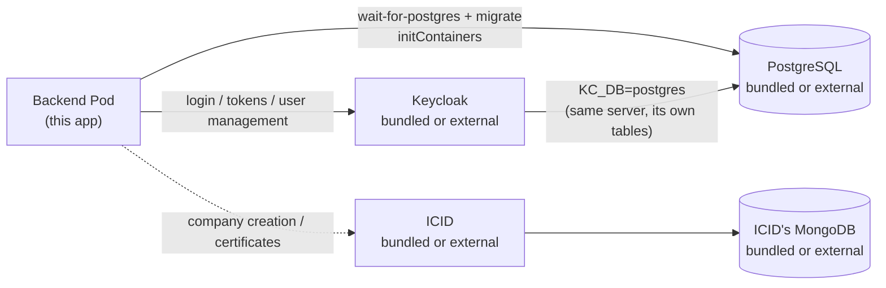

# ifric-registry-service Helm chart

Deploys the registry service and, optionally, everything it depends on:
PostgreSQL, Keycloak (its sole identity provider) and
[ICID](https://github.com/IndustryFusion/icidservice).

**Setup is automated.** Jobs create the Keycloak realm, clients and
mappers, and load seed data. A default install needs no admin console and
no secrets copied by hand.

[Quick start](#quick-start) ·
[Choose your setup](#choose-your-setup) ·
[Install sequence](#install-sequence) ·
[Keycloak](#keycloak) ·
[Dataspace](#dataspace-participants) ·
[Seed data](#seed-data) ·
[Reference](#reference) ·
[Troubleshooting](#troubleshooting)

---

## Quick start

```bash
cd backend
docker build -t <registry>/ifric-registry-service:<tag> .
docker push  <registry>/ifric-registry-service:<tag>
cd ..

helm install my-registry charts/ifric-registry-service \
  --set image.repository=<registry>/ifric-registry-service \
  --set image.tag=<tag> \
  --set env.icidServiceBackendUrl=https://your-icid.example.com
```

You get bundled PostgreSQL and Keycloak, migrations applied, realm and
clients created, seed data loaded, backend running.

Add `-f charts/ifric-registry-service/values-full.yaml` to bundle ICID too,
and drop the `env.icidServiceBackendUrl` flag.

---

## Choose your setup

Three independent toggles. Each backing service is bundled or external, and
they mix freely.



### `postgres.enabled`

| | You get | You set |
|---|---|---|
| `true` *(default)* | StatefulSet + PVC, provisioned from `postgres.auth.*` | nothing |
| `false` | nothing — backend and Keycloak connect out | `postgres.external.host`, `.port`, and `postgres.auth.*` |

Two easy mistakes:

- **Keycloak uses this same database** (`KC_DB=postgres`, its own tables).
  Point at an external server and it hosts Keycloak's schema too, so the
  credentials need rights to create it.
- **`postgres.auth.*` changes meaning.** Bundled, it *creates* the user and
  database. External, it's what the app *logs in with* — it must already be
  true over there.

TLS is off by default (the bundled Postgres has no TLS listener). Managed
Postgres usually needs:

```yaml
env:
  dbSsl: true
  dbSslRejectUnauthorized: false   # or true + dbSslCa for a private CA
```

### `keycloak.enabled`

| | You get | You set |
|---|---|---|
| `true` *(default)* | Keycloak Deployment (`start-dev`) on the Postgres above; URL and realm computed | nothing |
| `false` | nothing — backend points at yours | `env.keycloak.url`, `env.keycloak.realm` *(install fails without them)* |

> **The URL needs its scheme.** `http://keycloak.ns.svc.cluster.local:8080`,
> not `keycloak.ns.svc.cluster.local:8080`. The app concatenates it
> directly, so a missing scheme fails inside the HTTP client instead of
> giving you a clear config error.

Separately, `keycloak.bootstrap.enabled` decides whether the chart
*configures* the realm — see [Keycloak](#keycloak). The two are
independent: an external instance needs the same objects, and the Job can
create them there.

### `icid.enabled`

ICID mints `company_ifric_id` and issues Hedera-backed certificates.

| | You get | You set |
|---|---|---|
| `false` *(default)* | nothing — backend calls out | `env.icidServiceBackendUrl` *(install fails without it)* |
| `true` *(via `values-full.yaml`)* | ICID Deployment + its MongoDB StatefulSet, replica set initialised automatically | nothing — or `icid.mongodb.enabled=false` + `.external.url` for your own |

Without a reachable ICID, only **company creation and certificates** fail,
and only at call time. Users, access groups, assets, twins, factories and
product tagging are unaffected.

```bash
# external Postgres, bundled Keycloak, external ICID
helm install my-registry charts/ifric-registry-service \
  --set image.repository=<registry>/ifric-registry-service --set image.tag=<tag> \
  --set postgres.enabled=false \
  --set postgres.external.host=pg.example.com \
  --set postgres.auth.user=ifric --set postgres.auth.password=<pw> --set postgres.auth.database=ifric \
  --set env.dbSsl=true --set env.dbSslRejectUnauthorized=false \
  --set env.icidServiceBackendUrl=https://icid.example.com
```

---

## Install sequence

```
1. Postgres StatefulSet                       (if bundled)
2. Keycloak Deployment                        (if bundled) — waits for Postgres
3. Backend Deployment
     initContainer  wait-for-postgres
     initContainer  migrate → npm run migration:run
4. hook post-install            → keycloak-bootstrap Job
5. hook post-install, weight 10 → seed Job       (backend /script)
                                → icid-seed Job  (if ICID bundled)
```

Between steps 3 and 4 the backend logs Keycloak errors — the clients don't
exist yet. It recovers on its own once the bootstrap Job finishes. No
restart needed.

---

## Keycloak

### Automatic *(default)*

`keycloak.bootstrap.enabled=true` runs a Job that creates:

| Object | Why |
|---|---|
| Realm: **unmanaged attributes enabled** | Keycloak 24+ silently drops unknown user attributes. The API returns `201`, but `company_ifric_id`/`user_id` are never stored — so tokens lack them and every endpoint 403s |
| Client `ifric` — confidential, direct access grants | end-user login is a ROPC password grant |
| Mappers `company_ifric_id`, `user_id` on `ifric` | puts the stored attributes into the token, which is what authorization reads |
| Client `ifric-admin` — confidential, service account | Admin API: create user, reset password, delete user |
| `realm-management:manage-users` on that account | without it those Admin API calls 403 |

Everything is checked before it's created, so the Job re-runs safely on
every upgrade and repairs a drifted realm.

**Two things the Job deliberately cannot do**, because it holds no
administrative credential: create the realm, and create the client it
authenticates as. It signs in as the service account of a confidential
client (`keycloak.bootstrap.clientId`, default `ifric-bootstrap`) that
holds `manage-clients`, `manage-realm` and `manage-users` in that one realm
— never as Keycloak's admin. So the realm and that one client are a
one-time manual step
([`docs/keycloak-first-time-checklist.md`](../../docs/keycloak-first-time-checklist.md)),
and `secrets.keycloakBootstrapClientSecret` is required; the render fails
with instructions if it is missing.

That is the whole point of the arrangement: an identity provider's root
account should not be a value in an application's chart. This Job can
manage one realm, cannot reach `master` or any other realm, cannot sign in
to the console, and is revoked by deleting one client.

**Client secrets need no copying.** Leave them blank and the chart
generates them, reuses them across upgrades, and the Job sets those exact
values on the Keycloak clients — both sides agree by construction. Set them
explicitly to choose your own.

Bootstrapping an **external** Keycloak works the same way and asks nothing
of that instance's admin account — whoever owns it creates the realm and
the bootstrap client, then hands you one client secret:

```yaml
keycloak:
  enabled: false
  bootstrap:
    enabled: true
    clientId: ifric-bootstrap   # created by that Keycloak's owner
secrets:
  keycloakBootstrapClientSecret: <from that client's Credentials tab>
env:
  keycloak:
    url: https://keycloak.example.com
    realm: ifric
```

`secrets.keycloakAdminPassword` and `keycloak.adminUser` play no part in
this topology — they apply **only** when the chart installs a fresh
Keycloak of its own and has to create that new instance's admin account.
Nothing here should ever hold the admin password of a Keycloak this chart
does not own.

The two **client** secrets still need nothing from you — the Job pushes
them onto the clients it creates in your realm, exactly as it does for a
bundled Keycloak.

### Manual

Use `keycloak.bootstrap.enabled=false` when the Keycloak belongs to another
team, or you want to own the realm yourself.

1. Follow [`docs/keycloak-first-time-checklist.md`](../../docs/keycloak-first-time-checklist.md)
   — the same objects as the table above, as click-by-click steps,
   **including the two realm settings**, which are easy to miss and fail
   confusingly. Why each one matters:
   [`docs/keycloak-setup.md`](../../docs/keycloak-setup.md).
2. Copy both client secrets from the admin console.
3. Supply them — nothing generates them in this mode:

```bash
helm upgrade my-registry charts/ifric-registry-service --reuse-values \
  --set secrets.keycloakClientSecret=<ifric secret> \
  --set secrets.keycloakAdminClientSecret=<ifric-admin secret>
```

Left blank here, the backend **fails fast at boot** — deliberately. A
generated secret would be one Keycloak never heard of, turning a clear
startup error into logins that fail for no visible reason.

Admin console of a **freshly installed** Keycloak (`keycloak.enabled=true`
only — the chart generated this password when it created that instance; an
existing Keycloak keeps its own admin credentials, which this chart neither
holds nor needs):

```bash
kubectl get secret my-registry-ifric-registry-service-keycloak-operator \
  -o jsonpath='{.data.KEYCLOAK_ADMIN_PASSWORD}' | base64 -d
kubectl port-forward svc/my-registry-ifric-registry-service-keycloak 8080:8080
```

---

## Dataspace participants

The dataspace is a separate application with **its own client in this same
realm**, owned by that team. This chart doesn't create it — it isn't ours.

| Client | Owned by | Its mappers | Claims in its tokens |
|---|---|---|---|
| `ifric` | this chart's bootstrap Job | `company_ifric_id`, `user_id` | those two |
| `data-space` | the dataspace team | `participant_id` | that one |

Why the split works cleanly:

- **Attributes** live on the user account and are shared realm-wide.
- **Mappers** live on a client and control only *that client's* tokens.
- So neither team's mappers affect the other's tokens, and neither needs
  anything from the other.

This service accepts **either** token. A company onboarded into the
dataspace gets a `participant_id` that is a verbatim copy of its
`company_ifric_id`, so a token carrying only `participant_id` is matched
against the `Company` table and treated as that company. Participants from
the dataspace's own registry match nothing here and are denied.

Nothing to configure. Full behaviour — including which endpoints a
participant token reaches — is in
[`docs/keycloak-setup.md`](../../docs/keycloak-setup.md#dataspace-participants-the-data-space-client).

---

## Seed data

`seed.enabled=true` *(default)* runs two Jobs — the two services keep
separate taxonomies in separate datastores.

| Job | Creates | Runs | Without it |
|---|---|---|---|
| backend seed | access groups (`admin`, `read_only`, ...), company categories, example products | install only | no access groups exist, so `createCompany` has no `admin` group to assign and every permission check fails |
| ICID seed *(bundled ICID only)* | dataspace, regions, countries, object types and sub-types | install **and** upgrade | ICID rejects `env.companyDefaultCode`'s codes, so company creation fails at call time |

The different schedules follow what each endpoint actually does:

- **Backend `/script` inserts unconditionally** — re-running would
  duplicate every group and category. Once per install, never again.
- **ICID's `/script` guards every write** — re-running converges, so
  enabling ICID on an existing release seeds it on the next upgrade.

Only a **bundled** ICID is seeded; an external one is its owner's to seed.

If a target isn't reachable within `seed.waitTimeoutSeconds` *(default
300)*, that Job logs the manual command and exits **without** failing the
release:

```bash
# backend
kubectl exec deploy/my-registry-ifric-registry-service-backend -- \
  node -e "fetch('http://localhost:4007/script',{method:'POST'}).then(r=>r.text()).then(console.log)"

# ICID
kubectl port-forward svc/my-registry-ifric-registry-service-icid 4010:4010
curl -X POST http://localhost:4010/script
```

---

## Reference

### Secrets

All land in one Kubernetes `Secret`. Generated values are minted once and
reused on every upgrade (read back from the live Secret), so upgrades never
rotate them out from under you.

| Value | Default | Notes |
|---|---|---|
| `secrets.keycloakClientSecret` | generated | only with bootstrap on; otherwise you must supply it |
| `secrets.keycloakAdminClientSecret` | generated | same |
| `secrets.keycloakAdminPassword` | generated | **Only when this chart installs a fresh Keycloak** (`keycloak.enabled=true`) — the console admin account it creates on first boot, generated and reused across upgrades, rendered into the Keycloak-operator Secret (never the app one). **Ignored entirely with an existing Keycloak** (`keycloak.enabled=false`): this chart never wants, asks for, or uses that instance's admin credential |
| `secrets.keycloakBootstrapClientSecret` | `""` | **required** when `keycloak.bootstrap.enabled=true`. Secret of the `ifric-bootstrap` client the Job authenticates as. Never generated — the client is created by hand, so only Keycloak knows its secret |
| `secrets.companyCreationApiKey` | generated | `X-API-Key` gate on `POST /company/create-company` |
| `secrets.hederaKeySecret` | `""` | optional — blank disables `/certificate/*` entirely |
| `postgres.auth.password` | `ifric` | provisions the bundled Postgres; must *match* an external one |
| `secrets.existingSecret` | `""` | your own Secret with keys `KEYCLOAK_CLIENT_SECRET`, `KEYCLOAK_ADMIN_CLIENT_SECRET`, `HEDERA_KEY_SECRET`, `COMPANY_CREATION_API_KEY`, `DB_PASSWORD`, plus `KEYCLOAK_ADMIN_PASSWORD`/`KEYCLOAK_BOOTSTRAP_CLIENT_SECRET` where those apply. Overrides all of the above; the chart then creates no Secret — including the app/operator split, so the backend's `envFrom` will see everything in it |

### Values

Full list with comments in `values.yaml`; mirrors `backend/.env.example`.

| Value | Default | Notes |
|---|---|---|
| `image.repository` / `.tag` | — | yours to build and push |
| `image.pullPolicy` | `Always` | deliberate — a mutable tag with `IfNotPresent` makes a node serve a stale cached image forever. Use `IfNotPresent` only with immutable tags |
| `replicaCount` | `1` | |
| `postgres.enabled` | `true` | `false` needs `postgres.external.host`/`.port` |
| `postgres.persistence.enabled` | `true` | `false` is ephemeral — testing only |
| `env.dbSsl` | `false` | the backend defaults it on; the chart forces it off for the bundled Postgres, which has no TLS listener |
| `keycloak.enabled` | `true` | `false` needs `env.keycloak.url`/`.realm` |
| `keycloak.bootstrap.enabled` | `true` | creates clients/mappers/realm settings; independent of `keycloak.enabled`. Needs the realm and `bootstrap.clientId` to exist already |
| `keycloak.bootstrap.clientId` | `ifric-bootstrap` | confidential client the Job authenticates as, in place of Keycloak's admin account |
| `icid.enabled` | `false` | `true` via `values-full.yaml`; `false` needs `env.icidServiceBackendUrl` |
| `icid.mongodb.enabled` | `true` | only when ICID is bundled |
| `seed.enabled` | `true` | both seed Jobs |
| `env.companyDefaultCode` | `IFX-COM-NAP` | must match an object-type/sub-type pair seeded in your ICID — compared case-sensitively |
| `ingress.enabled` | `false` | needs `ingress.host` |
| `ingress.className` | `""` | `nginx` also emits `rewrite-target: /$1` and switches the rule to the `/(.*)` + `ImplementationSpecific` form |
| `certManager.enabled` | `false` | `true` needs `certManager.clusterIssuer`; adds the cluster-issuer annotation **and** the `tls` block cert-manager requires |
| `certManager.clusterIssuer` | `""` | name of a ClusterIssuer that already exists in the cluster |

---

## Troubleshooting

```bash
kubectl logs job/my-registry-ifric-registry-service-keycloak-bootstrap
kubectl logs job/my-registry-ifric-registry-service-seed
kubectl logs job/my-registry-ifric-registry-service-icid-seed
kubectl logs <backend-pod> -c migrate
```

**Backend crash-loops on a missing env var.** `env.constants.ts` fails
fast. With bootstrap off, that's expected until you supply both client
secrets.

**Login works, every endpoint 403s.** The token lacks
`company_ifric_id`/`user_id` — either the mappers are missing or the realm
is dropping the attributes. Both are what the bootstrap Job prevents.
Decode a real token before digging further. Accounts predating the mappers
need `npm run backfill:keycloak-attributes`.

**`pg_hba.conf rejects connection ... no encryption`.** Your Postgres wants
TLS: set `env.dbSsl=true`. If the next error mentions a self-signed
certificate, add `env.dbSslRejectUnauthorized=false` or supply
`env.dbSslCa`.

**A values change doesn't reach the Pod.** ConfigMap-only edits don't roll
the Deployment — `kubectl delete pod -l
app.kubernetes.io/component=backend`. If the *image* looks stale, compare
the node's digest with your registry:
`kubectl get pod <pod> -o jsonpath='{.status.initContainerStatuses[*].imageID}'`.

**MongoDB Pod never appears**, with a `FailedCreate` event about a label
over 63 characters. Release name too long. The chart truncates StatefulSet
names to 52 to leave room for the `controller-revision-hash` label, so this
is rare — shorten the release name or set `fullnameOverride`.

**Bootstrap Job can't authenticate.** Check that `env.keycloak.url`
includes the scheme, that the realm `env.keycloak.realm` exists, that
`keycloak.bootstrap.clientId` exists inside it with client authentication
ON and service accounts ENABLED, and that
`secrets.keycloakBootstrapClientSecret` matches that client's Credentials
tab. The Job cannot create the realm or that client — by design, since
doing so would mean holding an administrative credential.
