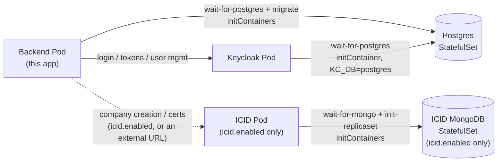

# ifric-registry-service Helm chart

Deploys this registry service to Kubernetes: PostgreSQL + a bundled
Keycloak (the app's sole identity provider), with an optional bundled
[ICID](https://github.com/IndustryFusion/icidservice) for company creation
and certificates. Two profiles, mirroring the root Compose files:

| Profile | Install with |
|---|---|
| Default (ICID external) | `values.yaml` alone |
| Full (+ bundled ICID) | `values.yaml` + `values-full.yaml` |



Postgres is shared by the backend and Keycloak (separate tables, no
collision). ICID and its MongoDB only exist when `icid.enabled: true`
(the full profile) — otherwise `env.icidServiceBackendUrl` points at an
external instance instead.

## Install

**1. Build and push this service's image** (ICID and Keycloak need no
build/push — both default to published images):

```bash
cd backend
docker build -t <your-registry>/ifric-registry-service:<tag> .
docker push <your-registry>/ifric-registry-service:<tag>
```

**2. Install the chart** — pick one:

```bash
# Default profile — needs a real, external ICID instance
helm install my-registry charts/ifric-registry-service \
  --set image.repository=<your-registry>/ifric-registry-service \
  --set image.tag=<tag> \
  --set env.icidServiceBackendUrl=https://your-real-icid.example.com

# Full profile — bundles ICID too, no extra --set needed for it
helm install my-registry charts/ifric-registry-service \
  -f charts/ifric-registry-service/values.yaml \
  -f charts/ifric-registry-service/values-full.yaml \
  --set image.repository=<your-registry>/ifric-registry-service \
  --set image.tag=<tag>
```

This succeeds, but the backend Pod **crash-loops** until step 3 is done.

**3. Configure Keycloak** (bundled, comes up empty — one-time manual step):

```bash
kubectl get secret my-registry-ifric-registry-service-secret \
  -o jsonpath='{.data.KEYCLOAK_ADMIN_PASSWORD}' | base64 -d
kubectl port-forward svc/my-registry-ifric-registry-service-keycloak 8080:8080
```

Open `http://localhost:8080`, log in as `admin` with the password above, then:

1. Create a realm (e.g. `ifric`).
2. Create a **confidential** client `ifric` with **Direct Access Grants**
   enabled. Copy its secret (Clients → `ifric` → Credentials).
3. Create a second **confidential** client `ifric-admin` with its
   **service account** enabled, granted the `realm-management` client's
   `manage-users` role. Copy its secret.

**4. Give the backend those secrets:**

```bash
helm upgrade my-registry charts/ifric-registry-service \
  --reuse-values \
  --set secrets.keycloakClientSecret=<step-3.2-secret> \
  --set secrets.keycloakAdminClientSecret=<step-3.3-secret>
```

The backend picks these up on its next restart and starts authenticating.

**5. Verify:**

```bash
kubectl get pods
kubectl port-forward svc/my-registry-ifric-registry-service-backend 4007:4007
curl http://localhost:4007/api-docs
```

To point at a fully external Keycloak instead of the bundled one, set
`keycloak.enabled=false` plus `env.keycloak.url`/`env.keycloak.realm` at
install time and skip step 3.

## Reference

**Secrets** (all in one Kubernetes `Secret`):

| Value | Default | Notes |
|---|---|---|
| `secrets.keycloakAdminPassword` | auto-generated | Keycloak admin console login; reused across upgrades |
| `secrets.keycloakClientSecret` | `""` | From step 3.2 above |
| `secrets.keycloakAdminClientSecret` | `""` | From step 3.3 above |
| `secrets.hederaKeySecret` | `""` | Optional — unset disables `/certificate/*` |
| `postgres.auth.password` | `ifric` | Changing it post-install doesn't rotate it inside an already-initialized Postgres volume |
| `secrets.existingSecret` | `""` | Name of a Secret you manage yourself (Vault, Sealed Secrets, ...) with keys `KEYCLOAK_ADMIN_PASSWORD`/`KEYCLOAK_CLIENT_SECRET`/`KEYCLOAK_ADMIN_CLIENT_SECRET`/`HEDERA_KEY_SECRET`/`DB_PASSWORD` — when set, overrides all of the above |

**Values** (full list with comments in `values.yaml`, mirrors `backend/.env.example`):

| Value | Default | Notes |
|---|---|---|
| `replicaCount` | `1` | Backend replica count |
| `postgres.persistence.enabled` | `true` | Set `false` for ephemeral storage — testing only |
| `keycloak.enabled` | `true` | Set `false` to point at an external Keycloak instead |
| `icid.enabled` | `false` | Set via `values-full.yaml` |
| `icid.mongodb.persistence.enabled` | `true` | Same ephemeral-storage toggle, for ICID's MongoDB |
| `ingress.enabled` | `false` | Requires `ingress.host` |
