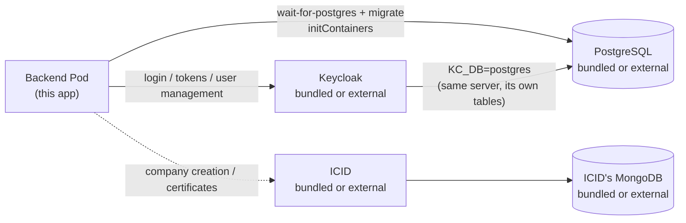

# ifric-registry-service Helm chart

Deploys the registry service to Kubernetes, together with as much or as
little of its backing infrastructure as you want: PostgreSQL, Keycloak (the
app's sole identity provider) and
[ICID](https://github.com/IndustryFusion/icidservice).

The chart also does the setup that used to be a manual click-through:
a **bootstrap Job** creates the Keycloak realm, both confidential clients
and the protocol mappers, and a **seed Job** loads the default RBAC groups
and taxonomy. On a default install there is nothing to configure by hand.

---

## Quick start

```bash
cd backend
docker build -t <registry>/ifric-registry-service:<tag> .
docker push  <registry>/ifric-registry-service:<tag>
cd ..

helm install my-registry charts/ifric-registry-service \
  --set image.repository=<registry>/ifric-registry-service \
  --set image.tag=<tag> \
  --set env.icidServiceBackendUrl=https://your-icid.example.com
```

That gives you: bundled PostgreSQL, bundled Keycloak (realm + clients +
mappers created for you), migrations applied, seed data loaded, backend
running. No secrets to copy, no admin console to visit.

Add `-f charts/ifric-registry-service/values-full.yaml` to bundle ICID as
well and drop the `env.icidServiceBackendUrl` flag.

---

## The three toggles

Each backing service is independently bundled or external. They combine
freely — bundled Keycloak with external Postgres and external ICID is a
perfectly normal setup.



### `postgres.enabled`

| | What happens | What you must set |
|---|---|---|
| `true` (default) | A single-replica StatefulSet + PVC. `postgres.auth.*` **provisions** it on first boot. | Nothing. Optionally `postgres.persistence.size`/`.storageClassName`. |
| `false` | No StatefulSet. Backend and Keycloak both connect out. | `postgres.external.host`, `.port`, and `postgres.auth.user`/`.password`/`.database` **matching credentials that already exist there**. |

Two things people get wrong here:

- **Keycloak shares this database.** `KC_DB=postgres` points the bundled
  Keycloak at the same server (its own tables, no collision), so with
  `postgres.enabled=false` your *external* server also hosts Keycloak's
  schema. The credentials in `postgres.auth.*` need rights to create it.
- **`postgres.auth.*` changes meaning.** Bundled, it *creates* the user and
  database. External, it's what the app *logs in with* — the values must
  already be true over there, and changing the password later won't
  re-provision anything.

TLS to an external Postgres is off unless you ask for it — the bundled one
has no TLS listener, so the chart sets `env.dbSsl=false`. Managed Postgres
usually requires it:

```yaml
env:
  dbSsl: true
  dbSslRejectUnauthorized: false   # or true + dbSslCa for a private CA
```

### `keycloak.enabled`

| | What happens | What you must set |
|---|---|---|
| `true` (default) | A Keycloak Deployment (`start-dev`), backed by the Postgres above. `KEYCLOAK_URL`/`KEYCLOAK_REALM` are computed for you; the realm defaults to `ifric`. | Nothing. |
| `false` | No Keycloak Pod. The backend points at yours. | `env.keycloak.url` and `env.keycloak.realm` (both `required` — install fails without them). |

> **`env.keycloak.url` must include the scheme.**
> `http://keycloak.ns.svc.cluster.local:8080`, not
> `keycloak.ns.svc.cluster.local:8080`. The app concatenates it directly
> (`${url}/realms/${realm}/...`), so a missing scheme produces requests
> that fail at the HTTP client rather than a clear configuration error.

Either way, **`keycloak.bootstrap.enabled` decides whether the chart
configures the realm** — see below. It is independent of
`keycloak.enabled`: an external Keycloak needs exactly the same objects,
and the Job is happy to create them there if you give it admin credentials.

### `icid.enabled`

ICID mints `company_ifric_id` and issues Hedera-backed certificates.

| | What happens | What you must set |
|---|---|---|
| `false` (default) | Nothing deployed. The backend calls out. | `env.icidServiceBackendUrl` — **`required`**, install fails without it. |
| `true` (via `values-full.yaml`) | ICID Deployment + its own MongoDB StatefulSet (single-node replica set, initialised by an initContainer). The URL is computed; `env.icidServiceBackendUrl` is ignored. | Nothing. Set `icid.mongodb.enabled=false` + `icid.mongodb.external.url` to use your own replica set. |

Without a reachable ICID, **company creation and certificates fail at call
time** — not at boot. Users, access groups, assets, twins, factories and
product tagging all work regardless.

```bash
# external Postgres, bundled Keycloak, external ICID
helm install my-registry charts/ifric-registry-service \
  --set image.repository=<registry>/ifric-registry-service --set image.tag=<tag> \
  --set postgres.enabled=false \
  --set postgres.external.host=pg.example.com \
  --set postgres.auth.user=ifric --set postgres.auth.password=<pw> --set postgres.auth.database=ifric \
  --set env.dbSsl=true --set env.dbSslRejectUnauthorized=false \
  --set env.icidServiceBackendUrl=https://icid.example.com
```

---

## What `helm install` actually does

```
1. Postgres StatefulSet                    (if bundled)
2. Keycloak Deployment                     (if bundled) — waits for Postgres
3. Backend Deployment
     initContainer wait-for-postgres
     initContainer migrate  → npm run migration:run
4. post-install hook, weight 0  → keycloak-bootstrap Job
     realm, user profile, ifric + ifric-admin clients, mappers, role grant
5. post-install hook, weight 10 → seed Jobs
     backend seed → waits for the backend, then POST /script
     icid seed    → waits for ICID, then POST /script   (if bundled)
```

The backend may log Keycloak errors between steps 3 and 4 — the clients do
not exist yet. It settles once the bootstrap Job finishes; no restart
needed.

---

## Keycloak setup

### Automatic (default)

`keycloak.bootstrap.enabled=true` runs a Job that creates, idempotently:

| | Why it's needed |
|---|---|
| The realm (`env.keycloak.realm`, default `ifric`) | Nothing else can exist without it |
| `unmanagedAttributePolicy=ENABLED` on the realm user profile | **Non-obvious.** Keycloak 24+ drops unknown user attributes silently — the Admin API still returns 201, but `company_ifric_id`/`user_id` are never stored, so every token comes back without them and every guarded endpoint 403s |
| `VERIFY_PROFILE` required action disabled | **Non-obvious.** It requires first *and* last name; the app only collects one name, so every user it creates would be stuck at `Account is not fully set up` and the password grant would fail |
| Client `ifric` — confidential, direct access grants on | End-user login is a ROPC password grant |
| Protocol mappers `company_ifric_id`, `user_id` on `ifric` | Projects the stored user attributes into the access token, which is what authorization reads |
| Client `ifric-admin` — confidential, service account on | Admin API calls: create user, reset password, delete user |
| `realm-management:manage-users` on that service account | Without it the Admin API calls 403 |

It re-runs on every `helm upgrade`, checking before creating, so it also
repairs a realm that drifted.

**The client secrets need no copying.** Leave
`secrets.keycloakClientSecret`/`keycloakAdminClientSecret` blank and the
chart generates them, reuses them across upgrades (via `lookup`, the same
way `keycloakAdminPassword` works), and the Job *sets* those exact values
on the Keycloak clients. Both sides agree by construction. Set them
explicitly if you'd rather choose the value.

For an **external** Keycloak, the Job needs credentials that can create a
realm there:

```yaml
keycloak:
  enabled: false
  adminUser: admin              # your external instance's admin
  bootstrap:
    enabled: true
secrets:
  keycloakAdminPassword: <that admin's password>
env:
  keycloak:
    url: https://keycloak.example.com
    realm: ifric
```

### Manual

Set `keycloak.bootstrap.enabled=false` if your Keycloak is owned by another
team, or you want to control the realm yourself. Then:

1. Follow [`docs/keycloak-setup.md`](../../docs/keycloak-setup.md) — it
   covers the same objects as the table above, **including the two
   non-obvious realm settings**, which are easy to miss by hand and produce
   confusing failures.
2. Read both client secrets from the admin console.
3. Supply them, because nothing will generate them for you:

```bash
helm upgrade my-registry charts/ifric-registry-service --reuse-values \
  --set secrets.keycloakClientSecret=<ifric secret> \
  --set secrets.keycloakAdminClientSecret=<ifric-admin secret>
```

With bootstrap off and these blank, the backend **fails fast at boot** —
deliberately. A generated secret would be one Keycloak has never heard of,
turning a clear startup error into logins that fail for no visible reason.

For the bundled Keycloak's admin console:

```bash
kubectl get secret my-registry-ifric-registry-service-secret \
  -o jsonpath='{.data.KEYCLOAK_ADMIN_PASSWORD}' | base64 -d
kubectl port-forward svc/my-registry-ifric-registry-service-keycloak 8080:8080
```

---

## Dataspace participants

A separate application — the dataspace — runs **its own client in this same
realm**, configured by that team. This chart does not create it and must
not: it isn't ours.

The split is simply which client owns which mapper:

| Client | Owned by | Mappers | Claims in its tokens |
|---|---|---|---|
| `ifric` | this chart's bootstrap Job | `company_ifric_id`, `user_id` | those two |
| `data-space` | the dataspace team | `participant_id` | that one |

Attributes live on the **user account**, which is shared realm-wide;
mappers live on a **client** and decide which attributes reach the tokens
*that client* issues. So neither team's mappers can affect the other's
tokens, and neither needs anything from the other.

This service accepts **either** token. When an IFRIC company is onboarded
into the dataspace, its `participant_id` is set to a verbatim copy of its
`company_ifric_id`, so a token carrying only `participant_id` is matched
against the `Company` table and treated as that company. Participants that
originated in the dataspace's own registry match nothing here and are
denied.

Nothing to configure in this chart for it. Full behaviour, including which
endpoints a participant token can reach, is in
[`docs/keycloak-setup.md`](../../docs/keycloak-setup.md#dataspace-participants-the-data-space-client).

---

## Seed data

`seed.enabled=true` (default) runs **two** Jobs, because the two services
keep separate taxonomies in separate datastores. Both are automatic.

| | Seeds | Hook | Why it matters |
|---|---|---|---|
| backend seed | access groups (`admin`, `read_only`, ...), company categories, example products | `post-install` **only** | A fresh database has no access groups at all, so `createCompany` has no `admin` group to assign and every permission check fails |
| ICID seed (`icid.enabled` only) | dataspace, regions, countries, object types and sub-types | `post-install`, `post-upgrade` | `env.companyDefaultCode` (`IFX-COM-NAP`) is split and sent to ICID on every company creation; ICID rejects codes it hasn't been seeded with, so an unseeded ICID means company creation fails at call time |

The differing hooks are not an oversight — they follow the two endpoints'
actual behaviour:

- **The backend's `/script` inserts unconditionally.** Running it on every
  upgrade would duplicate every access group and category, so it runs once
  per install and never again.
- **ICID's `/script` guards every write** (`findOne` on the dataspace, an
  `$in` query on object types, `countDocuments` on countries). Re-running
  converges instead of duplicating — which also means enabling ICID on an
  existing release seeds it on the next `helm upgrade`, no manual step.

Only the **bundled** ICID is seeded. With `icid.enabled=false` you're
pointing at someone else's instance, which is theirs to seed.

If either target never becomes reachable within `seed.waitTimeoutSeconds`
(default 300), that Job logs the manual command and exits *without* failing
the release:

```bash
# backend
kubectl exec deploy/my-registry-ifric-registry-service-backend -- \
  node -e "fetch('http://localhost:4007/script',{method:'POST'}).then(r=>r.text()).then(console.log)"

# ICID
kubectl port-forward svc/my-registry-ifric-registry-service-icid 4010:4010
curl -X POST http://localhost:4010/script
```

---

## Reference

### Secrets

All land in one Kubernetes `Secret`.

| Value | Default | Notes |
|---|---|---|
| `secrets.keycloakClientSecret` | generated | Only when `keycloak.bootstrap.enabled`; otherwise required from you |
| `secrets.keycloakAdminClientSecret` | generated | Same |
| `secrets.keycloakAdminPassword` | generated | Keycloak's admin login. With an external Keycloak + bootstrap on, set it to *that* instance's admin password |
| `secrets.companyCreationApiKey` | generated | `X-API-Key` gate on `POST /company/create-company` |
| `secrets.hederaKeySecret` | `""` | Optional — blank disables `/certificate/*` entirely |
| `postgres.auth.password` | `ifric` | Provisions the bundled Postgres; must *match* an external one |
| `secrets.existingSecret` | `""` | Your own Secret with keys `KEYCLOAK_ADMIN_PASSWORD`, `KEYCLOAK_CLIENT_SECRET`, `KEYCLOAK_ADMIN_CLIENT_SECRET`, `HEDERA_KEY_SECRET`, `COMPANY_CREATION_API_KEY`, `DB_PASSWORD`. Overrides everything above and the chart creates no Secret |

Generated values are minted once and **reused on every later upgrade** by
reading the live Secret back, so upgrades never rotate them out from under
you.

### Values

Full list with comments in `values.yaml`; it mirrors `backend/.env.example`.

| Value | Default | Notes |
|---|---|---|
| `image.repository` / `.tag` | — | Yours to build and push |
| `image.pullPolicy` | `Always` | Deliberate: mutable tags plus `IfNotPresent` make a node serve a stale cached image forever. Switch to `IfNotPresent` only with immutable tags |
| `replicaCount` | `1` | |
| `postgres.enabled` | `true` | `false` needs `postgres.external.host`/`.port` |
| `postgres.persistence.enabled` | `true` | `false` is ephemeral — testing only |
| `env.dbSsl` | `false` | Backend defaults it on; the chart forces it off for the bundled Postgres, which has no TLS listener |
| `keycloak.enabled` | `true` | `false` needs `env.keycloak.url`/`.realm` |
| `keycloak.bootstrap.enabled` | `true` | Creates realm/clients/mappers. Independent of `keycloak.enabled` |
| `icid.enabled` | `false` | `true` via `values-full.yaml`; `false` needs `env.icidServiceBackendUrl` |
| `icid.mongodb.enabled` | `true` | Only when ICID is bundled |
| `seed.enabled` | `true` | `post-install` only |
| `env.companyDefaultCode` | `IFX-COM-NAP` | Must match an object-type/subtype pair seeded in your ICID, compared case-sensitively |
| `ingress.enabled` | `false` | Needs `ingress.host` |

---

## Troubleshooting

**Backend crash-loops with a missing-env error.** `env.constants.ts` fails
fast. With bootstrap off, this is the expected state until you supply both
client secrets.

**Login works, but every endpoint returns 403.** The token has no
`company_ifric_id`/`user_id`. Either the mappers are missing, or the realm
is dropping the attributes (`unmanagedAttributePolicy`) — both are what the
bootstrap Job exists to prevent. Decode a real token before digging
further. Accounts created before the mappers existed need
`npm run backfill:keycloak-attributes`.

**`pg_hba.conf rejects connection ... no encryption`.** Your Postgres
requires TLS: set `env.dbSsl=true`. If the next error mentions a
self-signed certificate, add `env.dbSslRejectUnauthorized=false` or supply
`env.dbSslCa`.

**A change to values doesn't reach the running Pod.** ConfigMap-only edits
don't roll the Deployment. `kubectl delete pod -l
app.kubernetes.io/component=backend` to force it. If the *image* seems
stale, check that the node's digest matches your registry — `kubectl get
pod <pod> -o jsonpath='{.status.initContainerStatuses[*].imageID}'`.

**MongoDB StatefulSet never creates its Pod**, with a `FailedCreate` event
about a label over 63 characters. Your release name is too long. The chart
truncates StatefulSet names to 52 to leave room for the pod's
`controller-revision-hash` label, so this should be rare — if you hit it,
shorten the release name or set `fullnameOverride`.

**The bootstrap Job fails to authenticate.** With an external Keycloak,
check that `env.keycloak.url` includes the scheme and that
`keycloak.adminUser` / `secrets.keycloakAdminPassword` are that instance's
admin credentials, not the bundled defaults.

```bash
kubectl logs job/my-registry-ifric-registry-service-keycloak-bootstrap
kubectl logs job/my-registry-ifric-registry-service-seed
kubectl logs <backend-pod> -c migrate
```
