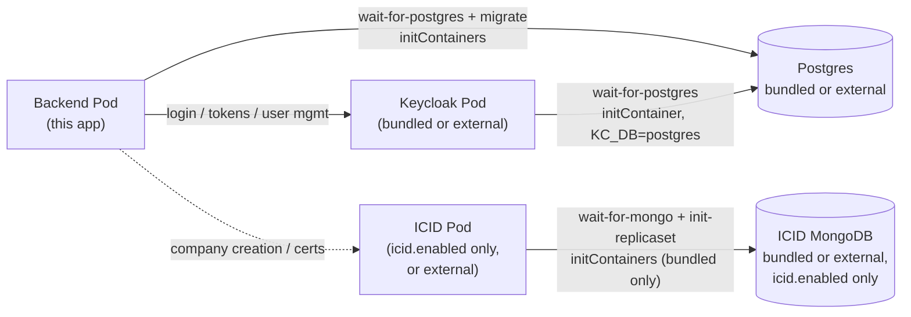

# ifric-registry-service Helm chart

Deploys this registry service to Kubernetes: PostgreSQL + a bundled
Keycloak (the app's sole identity provider), with an optional bundled
[ICID](https://github.com/IndustryFusion/icidservice) for company creation
and certificates. Two profiles, mirroring the root Compose files:

| Profile | Install with |
|---|---|
| Default (ICID external) | `values.yaml` alone |
| Full (+ bundled ICID) | `values.yaml` + `values-full.yaml` |



Postgres is shared by the backend and Keycloak (separate tables, no
collision).

## Topology — bundled or external, independently

Every backing service can be either deployed by this chart or pointed at
one you already run — pick per component:

| Component | Bundled (default) | External |
|---|---|---|
| PostgreSQL | `postgres.enabled=true` | `postgres.enabled=false` + `postgres.external.host`/`.port` |
| Keycloak | `keycloak.enabled=true` | `keycloak.enabled=false` + `env.keycloak.url`/`.realm` |
| ICID | `icid.enabled=true` (`values-full.yaml`) | `icid.enabled=false` (default) + `env.icidServiceBackendUrl` |
| ICID's MongoDB | `icid.mongodb.enabled=true` (default, only when ICID is bundled) | `icid.mongodb.enabled=false` + `icid.mongodb.external.url` |

These combine freely — e.g. bundled Keycloak + external Postgres +
external ICID, or external Keycloak + bundled Postgres + bundled ICID with
its own external MongoDB. A fully-external install (everything above set
to external) deploys just the backend Pod and nothing else.

```bash
# Example: external Postgres, bundled Keycloak, external ICID
helm install my-registry charts/ifric-registry-service \
  --set image.repository=<your-registry>/ifric-registry-service --set image.tag=<tag> \
  --set postgres.enabled=false --set postgres.external.host=my-pg.example.com \
  --set env.icidServiceBackendUrl=https://your-real-icid.example.com

# Example: full profile, but ICID's MongoDB is your own external replica set
helm install my-registry charts/ifric-registry-service \
  -f charts/ifric-registry-service/values.yaml -f charts/ifric-registry-service/values-full.yaml \
  --set image.repository=<your-registry>/ifric-registry-service --set image.tag=<tag> \
  --set icid.mongodb.enabled=false \
  --set icid.mongodb.external.url="mongodb://my-mongo.example.com:27017/icid-service?replicaSet=rs0"
```

## Install

**1. Build and push this service's image** (ICID and Keycloak need no
build/push — both default to published images):

```bash
cd backend
docker build -t <your-registry>/ifric-registry-service:<tag> .
docker push <your-registry>/ifric-registry-service:<tag>
```

**2. Install the chart** — pick a profile (see [Topology](#topology-bundled-or-external-independently)
above for external-Postgres/external-Mongo variants):

```bash
# Default profile — needs a real, external ICID instance
helm install my-registry charts/ifric-registry-service \
  --set image.repository=<your-registry>/ifric-registry-service \
  --set image.tag=<tag> \
  --set env.icidServiceBackendUrl=https://your-real-icid.example.com

# Full profile — bundles ICID too, no extra --set needed for it
helm install my-registry charts/ifric-registry-service \
  -f charts/ifric-registry-service/values.yaml \
  -f charts/ifric-registry-service/values-full.yaml \
  --set image.repository=<your-registry>/ifric-registry-service \
  --set image.tag=<tag>
```

This succeeds, but the backend Pod **crash-loops** until step 3 is done
(unless you set `keycloak.enabled=false` with an already-configured
external Keycloak, in which case skip to step 5).

**3. Configure Keycloak** (bundled, comes up empty — one-time manual step):

```bash
kubectl get secret my-registry-ifric-registry-service-secret \
  -o jsonpath='{.data.KEYCLOAK_ADMIN_PASSWORD}' | base64 -d
kubectl port-forward svc/my-registry-ifric-registry-service-keycloak 8080:8080
```

Open `http://localhost:8080`, log in as `admin` with the password above, then:

1. Create a realm (e.g. `ifric`).
2. Create a **confidential** client `ifric` with **Direct Access Grants**
   enabled. Copy its secret (Clients → `ifric` → Credentials).
3. Create a second **confidential** client `ifric-admin` with its
   **service account** enabled, granted the `realm-management` client's
   `manage-users` role. Copy its secret.

**4. Give the backend those secrets:**

```bash
helm upgrade my-registry charts/ifric-registry-service \
  --reuse-values \
  --set secrets.keycloakClientSecret=<step-3.2-secret> \
  --set secrets.keycloakAdminClientSecret=<step-3.3-secret>
```

The backend picks these up on its next restart and starts authenticating.

**5. Verify:**

```bash
kubectl get pods
kubectl port-forward svc/my-registry-ifric-registry-service-backend 4007:4007
curl http://localhost:4007/api-docs
```

## Reference

**Secrets** (all in one Kubernetes `Secret`):

| Value | Default | Notes |
|---|---|---|
| `secrets.keycloakAdminPassword` | auto-generated | Keycloak admin console login; reused across upgrades. Only relevant with the bundled Keycloak. |
| `secrets.keycloakClientSecret` | `""` | From step 3.2 above |
| `secrets.keycloakAdminClientSecret` | `""` | From step 3.3 above |
| `secrets.hederaKeySecret` | `""` | Optional — unset disables `/certificate/*` |
| `postgres.auth.password` | `ifric` | Also the password used to connect to an external Postgres — set it to match. Changing it post-install doesn't rotate it inside an already-initialized bundled Postgres volume. |
| `secrets.existingSecret` | `""` | Name of a Secret you manage yourself (Vault, Sealed Secrets, ...) with keys `KEYCLOAK_ADMIN_PASSWORD`/`KEYCLOAK_CLIENT_SECRET`/`KEYCLOAK_ADMIN_CLIENT_SECRET`/`HEDERA_KEY_SECRET`/`DB_PASSWORD` — when set, overrides all of the above |

**Values** (full list with comments in `values.yaml`, mirrors `backend/.env.example`):

| Value | Default | Notes |
|---|---|---|
| `replicaCount` | `1` | Backend replica count |
| `postgres.enabled` | `true` | Set `false` + `postgres.external.host`/`.port` for an external instance |
| `postgres.persistence.enabled` | `true` | Set `false` for ephemeral storage — testing only; ignored when `postgres.enabled=false` |
| `keycloak.enabled` | `true` | Set `false` + `env.keycloak.url`/`.realm` for an external instance |
| `icid.enabled` | `false` | Set via `values-full.yaml`; `false` needs `env.icidServiceBackendUrl` pointed at an external instance |
| `icid.mongodb.enabled` | `true` | Only relevant when `icid.enabled=true`. Set `false` + `icid.mongodb.external.url` for an external replica set |
| `icid.mongodb.persistence.enabled` | `true` | Same ephemeral-storage toggle, for the bundled MongoDB |
| `ingress.enabled` | `false` | Requires `ingress.host` |
