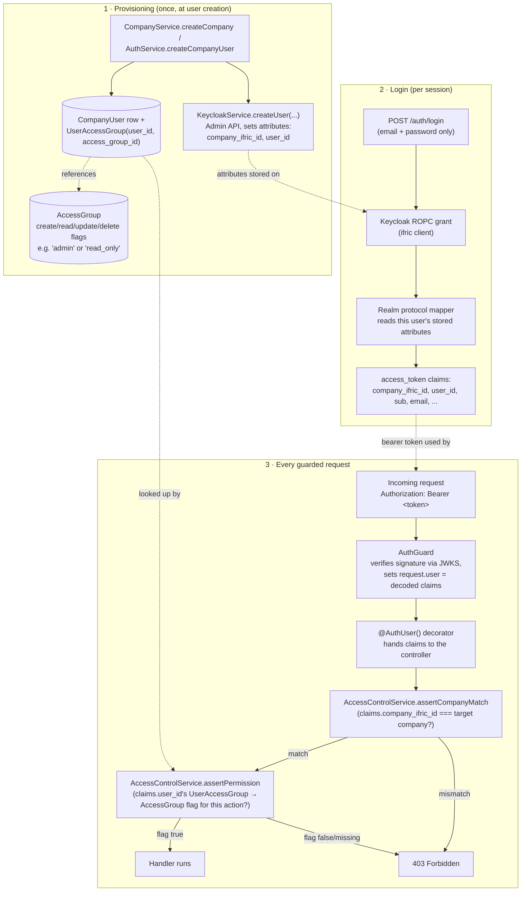

# Keycloak setup

Keycloak is this app's sole identity provider — there is no local auth
fallback. It needs a one-time **manual** setup before login (or anything
guarded) works, because there's no safe way to auto-provision client
secrets before a human has interacted with the just-deployed instance. This
doc is the shared source for that setup — linked from the root README's
[Local Development](../README.md#local-development) and
[Kubernetes Deployment](../README.md#kubernetes-deployment) sections, and
from [`charts/ifric-registry-service/README.md`](../charts/ifric-registry-service/README.md).

You need to create, in the target realm:

1. A realm (e.g. `ifric`) — any deployment gets its own.
2. A **confidential** client `ifric` with **Direct Access Grants** enabled
   — this is what end users authenticate against (`POST /auth/login`, a
   Resource Owner Password Credentials grant).
3. A second **confidential** client `ifric-admin` with its **service
   account** enabled, granted the `realm-management` client's
   `manage-users` role — used only for Admin API calls (create/reset-
   password/delete users). Kept separate from `ifric` so a leaked
   end-user-facing client secret can't also manage the realm's users.
4. Two **User Attribute** protocol mappers on the `ifric` client (Client
   scopes → `ifric`-dedicated → Mappers → Add mapper → By configuration →
   User Attribute):
   - User Attribute `company_ifric_id` → Token Claim Name
     `company_ifric_id`, Claim JSON Type `String`, **Add to access token** on.
   - User Attribute `user_id` → Token Claim Name `user_id`, Claim JSON Type
     `String`, **Add to access token** on.

   Every `CompanyUser` gets these two attributes stamped onto its Keycloak
   account the moment it's created (`CompanyService.createCompany`,
   `AuthService.createCompanyUser`, via the Admin API) — the mappers just
   project them into the access token as real claims, so company-scoped
   endpoints can check the token's own `company_ifric_id`/`user_id` against
   the request instead of trusting whatever id the caller puts in the body.

Both clients (and the two mappers) must already exist — this app never
provisions them itself; `env.constants.ts` fails fast at boot if the client
secrets are missing.

## Local (Docker Compose)

Keycloak comes up at `http://localhost:8080` unconfigured:

1. Log in to the admin console (`admin`/`admin` — dev-only).
2. Do steps 1–4 above.
3. Put both client secrets + the realm + `KEYCLOAK_URL=http://localhost:8080`
   into `backend/.env`, then start (or restart) the app.

## Kubernetes (Helm)

The bundled Keycloak Pod comes up unconfigured too:

```bash
kubectl get secret <release>-ifric-registry-service-secret \
  -o jsonpath='{.data.KEYCLOAK_ADMIN_PASSWORD}' | base64 -d
kubectl port-forward svc/<release>-ifric-registry-service-keycloak 8080:8080
```

Open `http://localhost:8080`, log in as `admin` with the password above, do
steps 1–4 above, then give the backend the two client secrets:

```bash
helm upgrade <release> charts/ifric-registry-service \
  --reuse-values \
  --set secrets.keycloakClientSecret=<ifric-secret> \
  --set secrets.keycloakAdminClientSecret=<ifric-admin-secret>
```

The backend picks these up on its next restart.

## Backfilling existing users

Accounts created before the two protocol mappers existed won't have the
`company_ifric_id`/`user_id` attributes. Run this once, from `backend/`,
against a running Postgres + reachable Keycloak:

```bash
npm run backfill:keycloak-attributes
```

Affected users need to log in again (or refresh) afterward to get a token
carrying the new claims — an already-issued token doesn't retroactively
gain them.

## RBAC architecture

How company/user scoping and permission checks actually work end to end —
provisioning a user, minting a token, and enforcing a request — all built
on the claims described above. RBAC in this app is **one `AccessGroup`
role per user per company** (`UserAccessGroup`, unique on `user_id`) — no
per-product dimension.



A few things worth noting from this picture:

- **Two completely separate systems hold the pieces**: Keycloak owns
  *identity* (who is this, is the signature valid) and never sees
  `AccessGroup`/`UserAccessGroup`; Postgres owns *authorization* (what can
  this user do) and never sees a password. The only bridge between them is
  the pair of claims stamped at provisioning time and replayed at every
  login.
- **A token is a claim of identity, not a live permission check** — the
  actual `create`/`read`/`update`/`delete` decision is always re-derived
  from `UserAccessGroup`/`AccessGroup` at request time
  (`AccessControlService`), never cached in the token itself. Changing a
  user's role takes effect on their *next* request, no token
  revocation needed.
- **A missing `company_ifric_id`/`user_id` claim is a hard failure**, not
  an implicit bypass — see [Backfilling existing users](#backfilling-existing-users)
  above for the one case this happens (pre-migration accounts).
