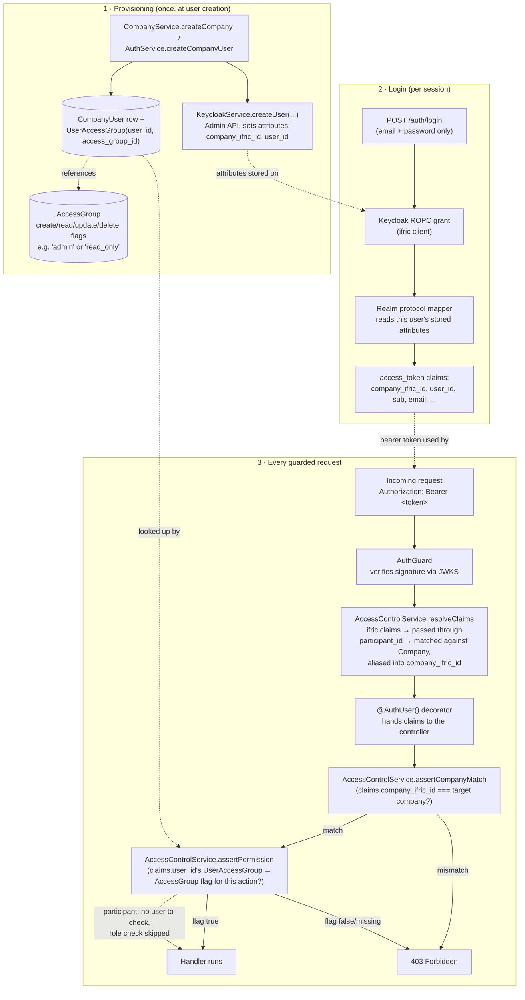

# Keycloak setup

Keycloak is this app's sole identity provider — there is no local auth
fallback. It needs a one-time **manual** setup before login (or anything
guarded) works, because there's no safe way to auto-provision client
secrets before a human has interacted with the just-deployed instance. This
doc is the shared source of truth for that setup — linked from the root
README's [Keycloak Authentication](../README.md#keycloak-authentication)
section and from
[`charts/ifric-registry-service/README.md`](../charts/ifric-registry-service/README.md).

> **Just want the steps?**
> [`keycloak-first-time-checklist.md`](keycloak-first-time-checklist.md) is
> the same setup as a bare click-by-click checklist, with admin-console
> paths and a verification step and none of the reasoning. Use it to *do*
> the setup; use this page to understand it or to debug it.

> **On Kubernetes most of this is automated.** The Helm chart's
> `keycloak.bootstrap.enabled` (default on) runs a Job that creates
> everything below, including the realm setting in step 1 that is easy to
> miss by hand. Two things stay manual on purpose: the realm itself and the
> `ifric-bootstrap` client the Job authenticates as, because the Job holds
> a scoped service account rather than Keycloak's admin credentials. Read this doc when you're on Compose, when the
> Keycloak belongs to another team, or when you want to know what that Job
> actually does. See
> [`charts/ifric-registry-service/README.md`](../charts/ifric-registry-service/README.md#keycloak).

You need to create, in the target realm:

1. A realm (e.g. `ifric`) — any deployment gets its own. One of its
   defaults must be changed, or the setup below will look correct and still
   not work (verified against Keycloak 26):
   - **Realm settings → General → Unmanaged attributes: `Enabled`.**
     Keycloak 24+ uses declarative user profiles, and unknown attributes
     are discarded by default. The Admin API still answers `201` when this
     app stores `company_ifric_id`/`user_id` — they just aren't there
     afterwards, the mappers in step 4 then project nothing, and every
     company-scoped endpoint returns 403 on a token that looks perfectly
     valid.

   `Verify Profile` (**Authentication → Required actions**) can stay on,
   its default. It requires both a first and a last name, and this app
   collects a single one — but `KeycloakService.createUser` splits that one
   name into `firstName`/`lastName` (`splitPersonName`) and never leaves
   either blank, precisely so this realm doesn't have to be weakened.
   Accounts created before that fix have no `lastName` and *are* blocked by
   it (`Account is not fully set up`, surfacing as `invalid_grant` on the
   ROPC login, with no browser flow in which the user could ever complete
   the profile) — give them one with `npm run backfill:keycloak-attributes`
   before enabling the action on a realm that has been running a while.
2. A **confidential** client `ifric` with **Direct Access Grants** enabled
   — this is what end users authenticate against (`POST /auth/login`, a
   Resource Owner Password Credentials grant).
3. A second **confidential** client `ifric-admin` with its **service
   account** enabled, granted the `realm-management` client's
   `manage-users` role — used only for Admin API calls (create/reset-
   password/delete users). Kept separate from `ifric` so a leaked
   end-user-facing client secret can't also manage the realm's users.
4. Two **User Attribute** protocol mappers on the `ifric` client (Client
   scopes → `ifric`-dedicated → Mappers → Add mapper → By configuration →
   User Attribute):
   - User Attribute `company_ifric_id` → Token Claim Name
     `company_ifric_id`, Claim JSON Type `String`, **Add to access token** on.
   - User Attribute `user_id` → Token Claim Name `user_id`, Claim JSON Type
     `String`, **Add to access token** on.

   Every `CompanyUser` gets these two attributes stamped onto its Keycloak
   account the moment it's created (`CompanyService.createCompany`,
   `AuthService.createCompanyUser`, via the Admin API). The mappers then
   project them into the access token as real claims. That lets
   company-scoped endpoints check the token's own
   `company_ifric_id`/`user_id` against the request, instead of trusting
   whatever id the caller puts in the body.

Both clients (and the two mappers) must already exist — this app never
provisions them itself; `env.constants.ts` fails fast at boot if the client
secrets are missing.

## Local (Docker Compose)

Keycloak comes up at `http://localhost:8080` unconfigured:

1. Log in to the admin console (`admin`/`admin` — dev-only).
2. Do steps 1–4 above.
3. Put both client secrets + the realm + `KEYCLOAK_URL=http://localhost:8080`
   into `backend/.env`, then start (or restart) the app.

## Kubernetes (Helm)

A Keycloak this chart **installed itself** (`keycloak.enabled=true`) comes
up unconfigured too. Its console password was generated by the chart when
it created the instance — that is the only situation in which this chart
holds an admin password at all. Pointing at an existing Keycloak
(`keycloak.enabled=false`)? Then use whatever admin credentials that
instance already has; the chart neither stores nor needs them.

```bash
kubectl get secret <release>-ifric-registry-service-keycloak-operator \
  -o jsonpath='{.data.KEYCLOAK_ADMIN_PASSWORD}' | base64 -d
kubectl port-forward svc/<release>-ifric-registry-service-keycloak 8080:8080
```

Open `http://localhost:8080`, log in as `admin` with the password above, do
steps 1–4 above, then give the backend the two client secrets:

```bash
helm upgrade <release> charts/ifric-registry-service \
  --reuse-values \
  --set secrets.keycloakClientSecret=<ifric-secret> \
  --set secrets.keycloakAdminClientSecret=<ifric-admin-secret>
```

The backend picks these up on its next restart.

## Backfilling existing users

Accounts created before the two protocol mappers existed won't have the
`company_ifric_id`/`user_id` attributes, and accounts created before
`createUser` started setting `lastName` have no surname (which is what the
`Verify Profile` required action refuses). The same script fixes both —
it rewrites the attributes and fills in `firstName`/`lastName` from
`CompanyUser.user_name`. Run it once, from `backend/`, against a running
Postgres + reachable Keycloak:

```bash
npm run backfill:keycloak-attributes
```

Affected users need to log in again (or refresh) afterward to get a token
carrying the new claims — an already-issued token doesn't retroactively
gain them.

## Dataspace participants (the `data-space` client)

A separate application — the dataspace — runs its own **confidential client
in this same realm**, configured by that team, not by this setup. Its
tokens carry a `participant_id` claim and its own RBAC runs entirely off
that claim; it needs nothing from this service. Do not create or manage
that client here.

Two properties make its tokens usable against this service:

- **Same realm means same signing keys.** `verifyAccessToken` checks the
  signature and the realm issuer, not `azp`/`aud`, so a dataspace token
  authenticates here already. Only authorization ever distinguished them.
- **`participant_id` is a copy of `company_ifric_id`.** When a company
  onboarded from IFRIC registers in the dataspace, its `participant_id` is
  set to that company's `company_ifric_id` verbatim. Nothing has to be
  mapped or kept in sync — matching the claim against `Company` *is* the
  resolution, which is why this feature adds no table and no column.

So a request is authorized if it carries **either** claim set:

| Token from | Claims | How it authorizes |
| --- | --- | --- |
| `ifric` | `company_ifric_id` + `user_id` | unchanged: company match, then role check |
| `data-space` | `participant_id` | matched against `Company`, aliased into `company_ifric_id`, **role check skipped** |

`AccessControlService.resolveClaims` does that normalization once, in
`AuthGuard`, so nothing downstream knows which client issued the token.

Participants that did **not** come from IFRIC carry ids from the
dataspace's own registry, which match no company here. They need no
special handling: the claim stays unresolved and the existing
"missing claim is a hard denial" rule rejects them.

Two consequences worth knowing:

- **The role check is skipped for participant tokens**, because a
  `participant_id` names a company and `UserAccessGroup` is keyed on a
  user — there is no person to look up. A participant therefore gets full
  create/read/update/delete **within its own company**, regardless of any
  role its people hold on the IFRIC side. The tenant boundary still holds:
  the alias means `assertCompanyMatch` confines it to that one company.
- **The exception is the handful of `AssetService` methods keyed by asset
  id rather than company id** (`deleteAssets`, `getAssetByAssetIfricId`,
  `getAssetManufacturer`, `getAssetOwner`, `getAssetFactoryLocation`,
  `getManufacturerOwnerAssets`). These call `assertPermission` as their
  only guard, so with the role check skipped there is nothing scoping them
  for a participant token.
- **Whoever assigns `participant_id` can name a company here.** This is
  safe only while ids issued to non-IFRIC participants can never equal a
  real `company_ifric_id` — i.e. they come from a different namespace than
  ICID's urns.

## RBAC architecture

How company/user scoping and permission checks actually work end to end —
provisioning a user, minting a token, and enforcing a request — all built
on the claims described above. RBAC in this app is **one `AccessGroup`
role per user per company** (`UserAccessGroup`, unique on `user_id`) — no
per-product dimension.



A few things worth noting from this picture:

- **Two completely separate systems hold the pieces**: Keycloak owns
  *identity* (who is this, is the signature valid) and never sees
  `AccessGroup`/`UserAccessGroup`; Postgres owns *authorization* (what can
  this user do) and never sees a password. The only bridge between them is
  the pair of claims stamped at provisioning time and replayed at every
  login.
- **The `create`/`read`/`update`/`delete` decision is always re-derived**
  from `UserAccessGroup`/`AccessGroup` at request time
  (`AccessControlService`), never cached in the token itself. Changing a
  user's role takes effect on their *next* request, no token
  revocation needed.
- **A missing `company_ifric_id`/`user_id` claim is a hard failure**, not
  an implicit bypass — see [Backfilling existing users](#backfilling-existing-users)
  above for the one case this happens (pre-migration accounts). The single
  deliberate exception is a `participant_id` that resolved to a real
  `Company`, which skips the role check only — see
  [Dataspace participants](#dataspace-participants-the-data-space-client).
- **`resolveClaims` runs in `AuthGuard`, not at the call sites.** That is
  what keeps the two token formats from leaking into ~30 authorization
  checks: normalize once at the boundary, and everything downstream sees a
  single shape. A change that makes a call site aware of `participant_id`
  is a sign the boundary has been breached.
